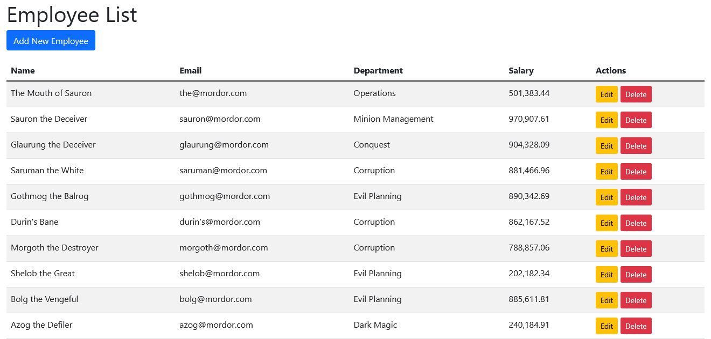
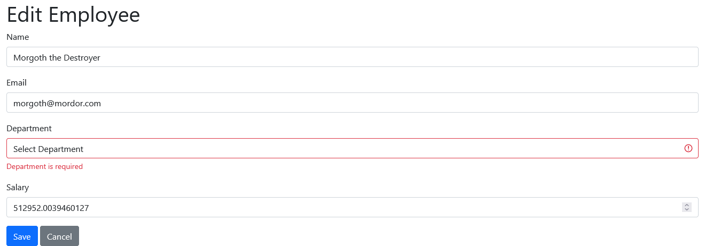

# Employee Management System

## Project Overview
A Spring Boot application for managing employees with the following features:
- CRUD operations for employee management
- Server-side validation
- H2 in-memory database
- Thymeleaf templating
- Bootstrap UI
- Themed around Tolkien-style villains for a fun twist
- Enum-based department management

## Setup Instructions

### Prerequisites
- Java 21 or later
- Maven

### Running the Application
1. Clone the repository
2. Navigate to the project directory
3. Run the application:
```powershell
./mvnw spring-boot:run
```
4. Access the application at `http://localhost:8080/employees`
5. Access the H2 console at `http://localhost:8080/h2-console` (credentials in application.properties)

### Features
- **Employee List**: View all employees with their details
- **Add/Edit Employee**: Create new employees or modify existing ones
- **Validation**: Server-side validation for all fields
- **Department Management**: Dropdown selection for departments
- **Initial Data**: Auto-populated with 10 Tolkien-style villain employees

### Database Schema
Employee table with the following fields:
- ID (auto-generated)
- Name (required, 2-100 characters)
- Email (required, valid email format)
- Department (enum: DARK_FORCES, EVIL_PLANNING, MINION_MANAGEMENT, etc.)
- Salary (required, positive number)

## Screenshots of the UI



## Development History / Prompts Used
0. Spring Initializr
1. Initial setup: Changed LLM to Claude
2. Base implementation:
   ```
   add a db table, controller and thymeleaf template based crud ui for employees with the following attributes: Name, Email, Department, and Salary. initialize the table with 10 random employees
   ```
3. Theme customization:
   ```
   change the initial employees to have random stereotypical tolkien style villain names
   ```
4. Department enhancement:
   ```
   change the department field to be a dropdown of existing departments and validate all values on the server
   ```
5. Documentation:
   ```
   create a README.md file with:
    Project overview
    Setup instructions
    Screenshots of the UI
    Prompts which has been used 
    Challenges which has been faced during the development
   ```

## Development Challenges
JAVA_HOME was set wrong so copilot agent failed to start the application and then proceeded to make erratic/nonsensical changes across the codebase trying to "fix" it
