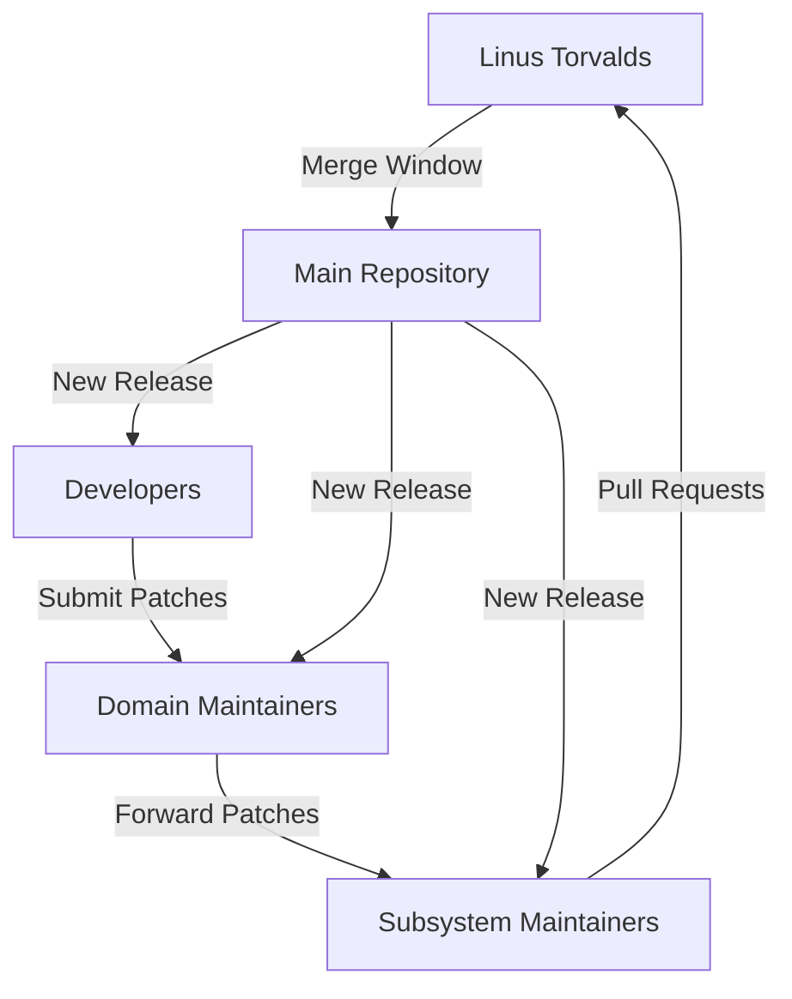
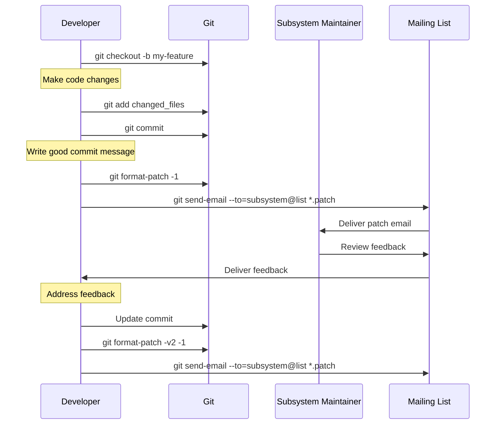
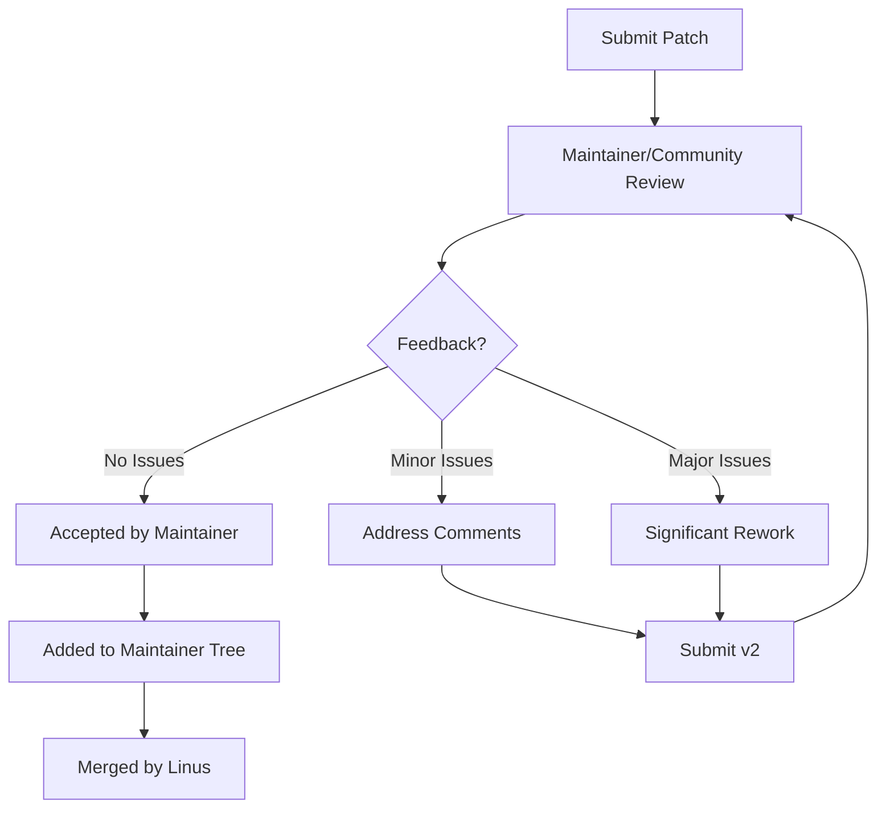

# Contributing to the Linux Kernel

This document provides guidelines for contributing to the Linux kernel. The Linux kernel is one of the largest and most active open source projects, with a well-established development process.

## Table of Contents

- [Code of Conduct](#code-of-conduct)
- [Getting Started](#getting-started)
- [Development Process](#development-process)
- [Patch Submission Process](#patch-submission-process)
- [Coding Style](#coding-style)
- [Testing](#testing)
- [Documentation](#documentation)
- [Subsystem-Specific Guidelines](#subsystem-specific-guidelines)

## Code of Conduct

Contributors to the Linux kernel are expected to adhere to the [Code of Conflict](https://www.kernel.org/doc/html/latest/process/code-of-conflict.html) and the [Contributor Covenant Code of Conduct](https://www.kernel.org/doc/html/latest/process/code-of-conduct.html).

## Getting Started

### Understanding the Kernel Development Model

The Linux kernel uses a distributed development model with a hierarchical structure:



### Finding Areas to Contribute

1. **Kernel Janitors**: Start with small cleanups and fixes. The [kernel janitors](https://kernelnewbies.org/KernelJanitors) project is good for beginners.

2. **TODO Lists**: Many subsystems maintain TODO lists in their documentation.

3. **Bug Fixes**: Look for bug reports on the [kernel bugzilla](https://bugzilla.kernel.org/) or subsystem mailing lists.

4. **Subsystem Interest**: Focus on a subsystem that aligns with your interests or expertise.

### Setting Up Your Development Environment

1. Set up your development environment as described in the [Setup Instructions](./setup.md).

2. Subscribe to relevant mailing lists:
   - [Linux Kernel Mailing List (LKML)](http://vger.kernel.org/vger-lists.html#linux-kernel)
   - Subsystem-specific mailing lists

3. Find the right maintainer for your area of interest in the [MAINTAINERS](./MAINTAINERS) file.

## Development Process

The Linux kernel follows a time-based release model:

```mermaid
gantt
    title Linux Kernel Release Cycle
    dateFormat  YYYY-MM-DD
    section Release Cycle
    Merge Window          :a1, 2023-01-01, 14d
    RC1                   :milestone, a1, 0d
    Stabilization Period  :a2, after a1, 56d
    RC2                   :milestone, 2023-01-22, 0d
    RC3                   :milestone, 2023-01-29, 0d
    RC4                   :milestone, 2023-02-05, 0d
    RC5                   :milestone, 2023-02-12, 0d
    RC6                   :milestone, 2023-02-19, 0d
    RC7                   :milestone, 2023-02-26, 0d
    Final Release         :milestone, after a2, 0d
    Next Merge Window     :a3, after a2, 14d
```

### Key Development Steps

1. **Identify the Issue**: Find a bug to fix or a feature to implement.

2. **Discuss on Mailing Lists**: Before starting significant work, discuss your approach on the relevant mailing list.

3. **Develop and Test**: Make your changes and test them thoroughly.

4. **Create Patches**: Format your changes as patches.

5. **Submit for Review**: Send your patches to the appropriate mailing list.

6. **Iterate Based on Feedback**: Address review comments and resubmit if necessary.

7. **Inclusion in Subsystem Tree**: If accepted, your patches will be added to the subsystem maintainer's tree.

8. **Merge Window**: Subsystem changes are pulled into Linus's tree during the merge window.

## Patch Submission Process

The Linux kernel uses email-based patch submission through mailing lists.

### Patch Preparation



### Commit Messages

The Linux kernel uses a specific commit message format:

```
Subject: [PATCH] subsystem: concise description of the change

Detailed explanation of the problem and solution. Explain what the 
change is doing, why it's needed, and how it works. Reference the 
issue it addresses (if any).

Link to relevant documentation, mailing list discussions, etc.

Signed-off-by: Your Name <your.email@example.com>
```

Key points for commit messages:

1. **First Line**: Subsystem/component followed by a brief description (50 chars max)
2. **Blank Line**: Separates subject from body
3. **Message Body**: Detailed explanation of what, why, and how
4. **Sign-off**: Must include your "Signed-off-by" line (Developer Certificate of Origin)

### Using git send-email

```bash
# Install git send-email
sudo apt install git-email

# Configure git send-email
git config --global sendemail.smtpEncryption tls
git config --global sendemail.smtpServer smtp.example.com
git config --global sendemail.smtpUser your.email@example.com
git config --global sendemail.smtpServerPort 587

# Create patches
git format-patch -o outgoing/ HEAD~3  # Last 3 commits

# Send patches
git send-email --to=relevant-list@vger.kernel.org outgoing/*.patch
```

### Developer Certificate of Origin (DCO)

All contributions to the Linux kernel must be made under the terms of the DCO, which you acknowledge by adding a "Signed-off-by" line to your commit message. This certifies that you have the right to submit your contribution under the open source license used by the Linux kernel.

```bash
# Add the Signed-off-by line automatically
git commit -s -m "Subject: descriptive message"
```

## Coding Style

The Linux kernel has a strict coding style documented in [Documentation/process/coding-style.rst](./Documentation/process/coding-style.rst). Some key points:

### Indentation and Formatting

- Use tabs for indentation (8 characters wide)
- Maximum line length is 80 characters
- Opening braces at the end of the line for functions, else on a new line
- No space before function/keyword parentheses, but space after keywords
- Space after commas

### Example

```c
/* Good example of kernel code style */
int function(int arg1, int arg2)
{
	if (arg1 > arg2) {
		arg1 = arg2;
		goto out;
	}

	/* Comments explain why, not what */
	for (i = 0; i < arg1; i++) {
		temp = calculate_value(i);
		if (temp == 0)
			break;
	}

out:
	return arg1;
}
```

### Naming Conventions

- Use descriptive names that reflect the purpose
- Use lowercase with underscores for most names
- Avoid Hungarian notation and typedefs
- Macros and enums in ALL_CAPS
- Global variables and functions should have descriptive prefixes

## Testing

Testing is critical for kernel development. The kernel provides several frameworks for testing.

### Types of Testing

1. **Unit Testing**: For individual functions and components
2. **Kunit**: In-kernel unit testing framework
3. **Kernel Selftests**: Functional tests in `tools/testing/selftests/`
4. **Runtime Testing**: Testing on actual hardware
5. **Static Analysis**: Using tools like sparse, smatch, and Coccinelle

### Using kunit

```bash
# Configure kernel with KUnit support
make ARCH=um kunit_defconfig

# Run specific KUnit tests
./tools/testing/kunit/kunit.py run --kunitconfig=.kunit/.kunitconfig \
  example_test foo_test_init_buffer

# Run all KUnit tests
./tools/testing/kunit/kunit.py run
```

### Using Selftests

```bash
# Build selftests
make -C tools/testing/selftests

# Run specific selftest
make -C tools/testing/selftests TARGETS=net run_tests

# Run all selftests
make -C tools/testing/selftests run_tests
```

### Static Analysis

```bash
# Run sparse on specific file
make C=1 drivers/net/ethernet/mydriver.o

# Run sparse on all files being built
make C=2

# Run Coccinelle
./scripts/coccicheck -m drivers/net/
```

## Documentation

Good documentation is essential for the kernel. New features should be documented, and existing documentation should be updated when changing functionality.

### Documentation Guidelines

1. **Kernel-Doc Format**: Document functions using the kernel-doc format
2. **File-Level Documentation**: Add comments at the top of files explaining their purpose
3. **RST Documentation**: Major features should have documentation in ReStructuredText format
4. **Update Existing Docs**: When changing behavior, update relevant documentation

### Example Kernel-Doc Comment

```c
/**
 * my_function - Brief description of function
 * @param1: Description of first parameter
 * @param2: Description of second parameter
 *
 * Detailed description of what the function does,
 * its algorithm, assumptions, and constraints.
 *
 * Context: Contexts in which this function can be called
 * (e.g., interrupt, process, rcu)
 *
 * Return: Description of return value
 */
int my_function(int param1, char *param2)
{
	/* Function implementation */
}
```

## Subsystem-Specific Guidelines

Different subsystems may have additional guidelines. Always check:

1. Documentation specific to the subsystem in the Documentation/ directory
2. Guidelines mentioned on the subsystem mailing list
3. README files in the subsystem directory
4. Ask the subsystem maintainer if unsure

### Common Subsystems

- **Networking**: Follow netdev submission guidelines
- **File Systems**: Each filesystem may have specific requirements
- **Device Drivers**: Follow guidelines for the specific bus/class
- **Architecture-Specific Code**: Follow architecture maintainer guidelines

## Review Process

After submitting patches, the review process typically follows these steps:



### Common Review Feedback

- Code style issues
- Missing tests
- Design concerns
- Performance considerations
- Security implications
- Documentation needs

## Getting Help

If you're stuck or have questions:

1. **Mailing Lists**: Ask on the appropriate subsystem mailing list
2. **IRC**: Join #kernelnewbies on OFTC for beginner questions
3. **Kernel Mentors**: The [kernel mentors program](https://kernelnewbies.org/KernelMentors)
4. **Documentation**: Read relevant documentation in the kernel source

## Recognition

Contributors are recognized in several ways:

1. **Commit Attribution**: Your name and email in the commit history
2. **CREDITS File**: Significant contributors are listed in the CREDITS file
3. **Maintainership**: Consistent, high-quality contributions may lead to maintainer status

Thank you for contributing to the Linux kernel!

## Code Style

We use automated tools to enforce consistent code style. Each language in our stack has specific guidelines.

### JavaScript/TypeScript

- We use ESLint with our [configuration](./.eslintrc.js)
- Run linting: `npm run lint`
- Run auto-fix: `npm run lint:fix`

### Rust

- We follow the Rust style guide enforced by rustfmt
- Run formatter: `cargo fmt`
- Run linting: `cargo clippy`

### SQL

- Use uppercase for SQL keywords
- Use snake_case for table and column names
- Include comments for complex queries

### General Guidelines

- Use meaningful variable and function names
- Keep functions small and focused
- Write explanatory comments for complex logic
- Use consistent indentation (2 spaces for JS/TS, 4 spaces for Rust)

## Testing Guidelines

All code changes should be accompanied by appropriate tests.

### Test Types

- **Unit Tests**: Test individual functions and classes
- **Integration Tests**: Test interactions between components
- **API Tests**: Test API endpoints
- **UI Tests**: Test user interface components
- **End-to-End Tests**: Test complete user workflows

### Running Tests

```bash
# Run all tests
npm test

# Run specific test suites
npm run test:unit
npm run test:integration
npm run test:e2e

# Run tests with coverage report
npm run test:coverage
```

### Test Guidelines

- Tests should be independent and repeatable
- Mock external dependencies
- Aim for high code coverage (>80%)
- Test both success and failure cases
- Use descriptive test names that explain the expected behavior

## Documentation

Good documentation is critical to our project's success.

### Types of Documentation

- **Code Comments**: Explain why, not what
- **API Documentation**: Document all endpoints, parameters, and responses
- **User Guides**: Help end users use the application
- **Development Guides**: Help developers understand the codebase
- **Architecture Docs**: Explain system design and decision-making

### Documentation Guidelines

- Keep documentation up-to-date with code changes
- Use clear, concise language
- Include examples where appropriate
- Use diagrams to explain complex systems or workflows
- Follow Markdown best practices for formatting

## Issue Tracking

We use GitHub Issues to track bugs, feature requests, and other tasks.

### Creating Issues

- Check existing issues before creating a new one
- Use the provided issue templates
- Provide detailed reproduction steps for bugs
- For feature requests, explain the use case and benefits

### Issue Labels

- **bug**: Something isn't working as expected
- **feature**: New feature request
- **enhancement**: Improvement to existing functionality
- **documentation**: Documentation-related tasks
- **good-first-issue**: Good for newcomers
- **help-wanted**: Actively seeking community help
- **security**: Security-related issues
- **performance**: Performance-related issues

## Recognition

Contributors are recognized in several ways:

- Listed in our [CONTRIBUTORS.md](./CONTRIBUTORS.md) file
- Mentioned in release notes for significant contributions
- Opportunity to become a maintainer after consistent quality contributions

Thank you for contributing to Linux Kernel Manager!
