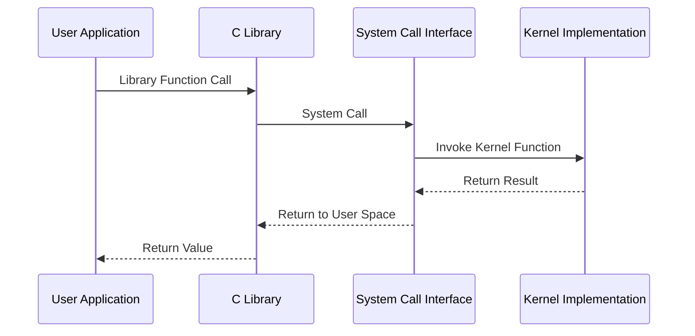

# Linux Kernel APIs

This document describes the key Application Programming Interfaces (APIs) provided by the Linux kernel for user applications and kernel modules.

## API Overview

The Linux kernel provides several interfaces for interaction:

1. **System Call Interface**: For user applications to request kernel services
2. **VFS API**: For file system operations
3. **Device Driver API**: For hardware interaction
4. **Networking API**: For network protocol implementation and socket operations
5. **Module API**: For extending kernel functionality

## System Call Interface



### Core System Calls

System calls are the primary method for applications to request services from the kernel. Here are some essential system calls grouped by functionality:

#### Process Management

| System Call | Description | Signature |
|------------|-------------|-----------|
| `fork()` | Create a new process | `pid_t fork(void)` |
| `exec*()` | Execute a program | `int execve(const char *pathname, char *const argv[], char *const envp[])` |
| `wait*()` | Wait for process to change state | `pid_t wait(int *wstatus)` |
| `exit()` | Terminate the calling process | `void exit(int status)` |
| `getpid()` | Get process identifier | `pid_t getpid(void)` |
| `kill()` | Send signal to a process | `int kill(pid_t pid, int sig)` |

#### Memory Management

| System Call | Description | Signature |
|------------|-------------|-----------|
| `brk()` | Change data segment size | `int brk(void *addr)` |
| `mmap()` | Map files or devices into memory | `void *mmap(void *addr, size_t length, int prot, int flags, int fd, off_t offset)` |
| `munmap()` | Unmap memory | `int munmap(void *addr, size_t length)` |
| `mprotect()` | Set protection on memory region | `int mprotect(void *addr, size_t len, int prot)` |

#### File Operations

| System Call | Description | Signature |
|------------|-------------|-----------|
| `open()` | Open and possibly create a file | `int open(const char *pathname, int flags, mode_t mode)` |
| `close()` | Close a file descriptor | `int close(int fd)` |
| `read()` | Read from a file descriptor | `ssize_t read(int fd, void *buf, size_t count)` |
| `write()` | Write to a file descriptor | `ssize_t write(int fd, const void *buf, size_t count)` |
| `lseek()` | Reposition read/write file offset | `off_t lseek(int fd, off_t offset, int whence)` |
| `stat()` | Get file status | `int stat(const char *pathname, struct stat *statbuf)` |

#### Networking

| System Call | Description | Signature |
|------------|-------------|-----------|
| `socket()` | Create an endpoint for communication | `int socket(int domain, int type, int protocol)` |
| `connect()` | Initiate a connection on a socket | `int connect(int sockfd, const struct sockaddr *addr, socklen_t addrlen)` |
| `bind()` | Bind a name to a socket | `int bind(int sockfd, const struct sockaddr *addr, socklen_t addrlen)` |
| `listen()` | Listen for connections on a socket | `int listen(int sockfd, int backlog)` |
| `accept()` | Accept a connection on a socket | `int accept(int sockfd, struct sockaddr *addr, socklen_t *addrlen)` |
| `send()/recv()` | Send/receive messages | `ssize_t send(int sockfd, const void *buf, size_t len, int flags)` |

## Kernel Module API

Kernel modules extend the kernel's functionality without requiring a system reboot. The kernel provides APIs for module management and integration.

### Key Module API Functions

| Function | Description | Signature |
|----------|-------------|-----------|
| `module_init()` | Define initialization function | `module_init(init_function)` |
| `module_exit()` | Define cleanup function | `module_exit(exit_function)` |
| `request_module()` | Request module loading | `int request_module(const char *fmt, ...)` |
| `try_module_get()` | Increment module reference count | `bool try_module_get(struct module *module)` |
| `module_put()` | Decrement module reference count | `void module_put(struct module *module)` |

### Device Driver APIs

The kernel provides several subsystem-specific APIs for device drivers:

#### Character Device API

```c
// Register a character device
int register_chrdev(unsigned int major, const char *name, const struct file_operations *fops);

// Unregister a character device
void unregister_chrdev(unsigned int major, const char *name);

// Allocate and register a character device region
int alloc_chrdev_region(dev_t *dev, unsigned baseminor, unsigned count, const char *name);

// Register a character device with explicit device numbers
int register_chrdev_region(dev_t from, unsigned count, const char *name);

// Add a character device to the system
void cdev_init(struct cdev *cdev, const struct file_operations *fops);
int cdev_add(struct cdev *cdev, dev_t dev, unsigned count);
```

#### Block Device API

```c
// Register a block device
int register_blkdev(unsigned int major, const char *name);

// Unregister a block device
void unregister_blkdev(unsigned int major, const char *name);

// Add a gendisk to the system
void add_disk(struct gendisk *disk);

// Remove a gendisk from the system
void del_gendisk(struct gendisk *disk);
```

#### Network Device API

```c
// Register a network device
int register_netdev(struct net_device *dev);

// Unregister a network device
void unregister_netdev(struct net_device *dev);

// Allocate a network device
struct net_device *alloc_netdev(int sizeof_priv, const char *name,
                               unsigned char name_assign_type,
                               void (*setup)(struct net_device *));
```

## VFS API

The Virtual File System (VFS) provides a common interface for various file systems. Key data structures and operations include:

### File Operations

The `file_operations` structure defines operations that can be performed on an open file:

```c
struct file_operations {
    struct module *owner;
    loff_t (*llseek) (struct file *, loff_t, int);
    ssize_t (*read) (struct file *, char __user *, size_t, loff_t *);
    ssize_t (*write) (struct file *, const char __user *, size_t, loff_t *);
    ssize_t (*read_iter) (struct kiocb *, struct iov_iter *);
    ssize_t (*write_iter) (struct kiocb *, struct iov_iter *);
    int (*ioctl) (struct inode *, struct file *, unsigned int, unsigned long);
    long (*unlocked_ioctl) (struct file *, unsigned int, unsigned long);
    long (*compat_ioctl) (struct file *, unsigned int, unsigned long);
    int (*mmap) (struct file *, struct vm_area_struct *);
    int (*open) (struct inode *, struct file *);
    int (*flush) (struct file *);
    int (*release) (struct inode *, struct file *);
    /* ... additional operations ... */
};
```

### Inode Operations

The `inode_operations` structure defines operations that can be performed on an inode:

```c
struct inode_operations {
    struct dentry * (*lookup) (struct inode *, struct dentry *, unsigned int);
    const char * (*get_link) (struct dentry *, struct inode *, struct delayed_call *);
    int (*permission) (struct user_namespace *, struct inode *, int);
    int (*create) (struct user_namespace *, struct inode *, struct dentry *, umode_t, bool);
    int (*link) (struct dentry *, struct inode *, struct dentry *);
    int (*unlink) (struct inode *, struct dentry *);
    int (*symlink) (struct user_namespace *, struct inode *, struct dentry *, const char *);
    int (*mkdir) (struct user_namespace *, struct inode *, struct dentry *, umode_t);
    int (*rmdir) (struct inode *, struct dentry *);
    /* ... additional operations ... */
};
```

## Networking Stack API

The networking subsystem provides APIs for implementing network protocols and managing network connections:

### Socket API

```c
// Create a new socket
int sock_create(int family, int type, int protocol, struct socket **res);

// Release a socket
void sock_release(struct socket *sock);

// Bind a socket to an address
int kernel_bind(struct socket *sock, struct sockaddr *addr, int addrlen);

// Connect a socket to a remote address
int kernel_connect(struct socket *sock, struct sockaddr *addr, int addrlen, int flags);

// Send data through a socket
int kernel_sendmsg(struct socket *sock, struct msghdr *msg, struct kvec *vec, 
                  size_t num, size_t len);

// Receive data from a socket
int kernel_recvmsg(struct socket *sock, struct msghdr *msg, struct kvec *vec,
                  size_t num, size_t len, int flags);
```

### Network Protocol Registration

```c
// Register a network protocol
int proto_register(struct proto *prot, int alloc_slab);

// Unregister a network protocol
void proto_unregister(struct proto *prot);

// Register a protocol family
int sock_register(const struct net_proto_family *fam);

// Unregister a protocol family
void sock_unregister(int family);
```

## Memory Management API

The kernel provides APIs for memory allocation and management:

### Core Memory Allocation

```c
// Allocate memory (may sleep)
void *kmalloc(size_t size, gfp_t flags);

// Free allocated memory
void kfree(const void *ptr);

// Allocate zeroed memory
void *kzalloc(size_t size, gfp_t flags);

// Allocate memory for an array and zero it
void *kcalloc(size_t n, size_t size, gfp_t flags);

// Allocate pages
struct page *alloc_pages(gfp_t gfp_mask, unsigned int order);

// Free pages
void __free_pages(struct page *page, unsigned int order);

// Get virtual address from page
void *page_address(const struct page *page);
```

### Memory Pools

```c
// Create a memory pool
mempool_t *mempool_create(int min_nr, mempool_alloc_t *alloc_fn,
                          mempool_free_t *free_fn, void *pool_data);

// Destroy a memory pool
void mempool_destroy(mempool_t *pool);

// Allocate from a memory pool
void *mempool_alloc(mempool_t *pool, gfp_t gfp_mask);

// Free memory from a memory pool
void mempool_free(void *element, mempool_t *pool);
```

## API Best Practices

1. **Kernel-Space vs. User-Space**: Understand the boundary between kernel and user space
2. **Memory Handling**: Always check for allocation failures and free allocated memory
3. **Locking**: Use appropriate locking mechanisms to prevent race conditions
4. **Error Handling**: Check return values and handle errors appropriately
5. **Backward Compatibility**: Maintain compatibility with older kernel versions
6. **Performance**: Consider performance implications, especially in critical paths
7. **Documentation**: Document API usage and behavior thoroughly

## API Stability

The Linux kernel maintains different levels of API stability:

1. **System Call Interface**: Highly stable, rarely changes
2. **Kernel Internal APIs**: May change between kernel versions
3. **Module APIs**: More stable than internal APIs but less stable than system calls

API stability is governed by the principle that user-space interfaces should never break, while kernel-space interfaces may evolve to support new features and improvements.

## Kernel Configurations

### List Configurations

**Endpoint:** `GET /configurations`

**Description:** Retrieves a list of kernel configurations

**Query Parameters:**
- `project_id` (optional): Filter by project
- `architecture` (optional): Filter by architecture
- `page` (optional): Page number for pagination
- `limit` (optional): Number of items per page

**Response:**
```json
{
  "status": "success",
  "data": {
    "configurations": [
      {
        "id": "f7e6d5c4-b3a2-1098-7654-321098765432",
        "name": "Server Optimized x86_64",
        "description": "Performance-focused configuration for server workloads",
        "baseVersion": "5.15.0",
        "architecture": "x86_64",
        "createdAt": "2025-05-15T08:30:00Z",
        "updatedAt": "2025-05-20T14:45:00Z",
        "creator": {
          "id": "a1b2c3d4-e5f6-7890-abcd-1234567890ab",
          "username": "johndoe"
        },
        "project": {
          "id": "b2c3d4e5-f6a7-8901-bcde-2345678901fg",
          "name": "Cloud Server Platform"
        }
      },
      {
        "id": "e5d4c3b2-a109-8765-4321-098765432109",
        "name": "IoT ARM Configuration",
        "description": "Minimal kernel for embedded ARM devices",
        "baseVersion": "5.10.0",
        "architecture": "arm64",
        "createdAt": "2025-04-10T09:15:00Z",
        "updatedAt": "2025-05-18T11:20:00Z",
        "creator": {
          "id": "b2c3d4e5-f6a7-8901-bcde-2345678901fg",
          "username": "janedoe"
        },
        "project": {
          "id": "c3d4e5f6-a7b8-9012-cdef-3456789012hi",
          "name": "Smart Device Platform"
        }
      }
    ],
    "pagination": {
      "total": 42,
      "page": 1,
      "limit": 10,
      "pages": 5
    }
  }
}
```

### Get Configuration Details

**Endpoint:** `GET /configurations/{id}`

**Description:** Retrieves detailed information about a specific kernel configuration

**Response:**
```json
{
  "status": "success",
  "data": {
    "id": "f7e6d5c4-b3a2-1098-7654-321098765432",
    "name": "Server Optimized x86_64",
    "description": "Performance-focused configuration for server workloads",
    "baseVersion": "5.15.0",
    "architecture": "x86_64",
    "createdAt": "2025-05-15T08:30:00Z",
    "updatedAt": "2025-05-20T14:45:00Z",
    "creator": {
      "id": "a1b2c3d4-e5f6-7890-abcd-1234567890ab",
      "username": "johndoe"
    },
    "project": {
      "id": "b2c3d4e5-f6a7-8901-bcde-2345678901fg",
      "name": "Cloud Server Platform"
    },
    "versions": [
      {
        "id": "d4e5f6a7-b8c9-0123-defg-456789012345",
        "version": "1.0.0",
        "createdAt": "2025-05-15T08:30:00Z",
        "isLocked": true
      },
      {
        "id": "e5f6a7b8-c9d0-1234-efgh-5678901234ij",
        "version": "1.1.0",
        "createdAt": "2025-05-20T14:45:00Z",
        "isLocked": false
      }
    ],
    "modules": [
      {
        "id": "f6a7b8c9-d0e1-2345-fghi-67890123456j",
        "name": "ext4",
        "path": "fs/ext4",
        "isBuiltin": true,
        "isRequired": true
      },
      {
        "id": "a7b8c9d0-e1f2-3456-ghij-7890123456kl",
        "name": "xfs",
        "path": "fs/xfs",
        "isBuiltin": false,
        "isRequired": false
      }
    ]
  }
}
```

### Create Configuration

**Endpoint:** `POST /configurations`

**Description:** Creates a new kernel configuration

**Request:**
```json
{
  "name": "RISC-V Server Config",
  "description": "Server configuration for RISC-V architecture",
  "baseVersion": "6.1.0",
  "architecture": "riscv64",
  "projectId": "c3d4e5f6-a7b8-9012-cdef-3456789012hi",
  "modules": [
    {
      "name": "ext4",
      "isBuiltin": true,
      "isRequired": true
    },
    {
      "name": "btrfs",
      "isBuiltin": false,
      "isRequired": false,
      "parameters": {
        "raid_levels": [0, 1, 10]
      }
    }
  ]
}
```

**Response:**
```json
{
  "status": "success",
  "data": {
    "id": "g7h8i9j0-k1l2-3456-mnop-7890123456rs",
    "name": "RISC-V Server Config",
    "description": "Server configuration for RISC-V architecture",
    "baseVersion": "6.1.0",
    "architecture": "riscv64",
    "createdAt": "2025-06-02T15:30:00Z",
    "updatedAt": "2025-06-02T15:30:00Z",
    "creator": {
      "id": "a1b2c3d4-e5f6-7890-abcd-1234567890ab",
      "username": "johndoe"
    },
    "project": {
      "id": "c3d4e5f6-a7b8-9012-cdef-3456789012hi",
      "name": "Smart Device Platform"
    },
    "versions": [
      {
        "id": "h8i9j0k1-l2m3-4567-nopq-8901234567tu",
        "version": "1.0.0",
        "createdAt": "2025-06-02T15:30:00Z",
        "isLocked": false
      }
    ]
  }
}
```

## Build Management

### Start Build

**Endpoint:** `POST /builds`

**Description:** Initiates a new kernel build

**Request:**
```json
{
  "configVersionId": "e5f6a7b8-c9d0-1234-efgh-5678901234ij",
  "environment": "production",
  "priority": "high",
  "options": {
    "debugSymbols": true,
    "optimizationLevel": 3,
    "compilerVersion": "gcc-13.2.0"
  }
}
```

**Response:**
```json
{
  "status": "success",
  "data": {
    "id": "i9j0k1l2-m3n4-5678-opqr-9012345678vw",
    "buildNumber": "BUILD-2025-06-02-001",
    "status": "queued",
    "startedAt": "2025-06-02T15:35:00Z",
    "estimatedCompletion": "2025-06-02T16:05:00Z",
    "configVersion": {
      "id": "e5f6a7b8-c9d0-1234-efgh-5678901234ij",
      "version": "1.1.0"
    },
    "config": {
      "id": "f7e6d5c4-b3a2-1098-7654-321098765432",
      "name": "Server Optimized x86_64"
    },
    "initiator": {
      "id": "a1b2c3d4-e5f6-7890-abcd-1234567890ab",
      "username": "johndoe"
    }
  }
}
```

### Get Build Status

**Endpoint:** `GET /builds/{id}`

**Description:** Retrieves the status and details of a specific build

**Response:**
```json
{
  "status": "success",
  "data": {
    "id": "i9j0k1l2-m3n4-5678-opqr-9012345678vw",
    "buildNumber": "BUILD-2025-06-02-001",
    "status": "in_progress",
    "progress": 65,
    "startedAt": "2025-06-02T15:35:00Z",
    "estimatedCompletion": "2025-06-02T16:05:00Z",
    "configVersion": {
      "id": "e5f6a7b8-c9d0-1234-efgh-5678901234ij",
      "version": "1.1.0"
    },
    "config": {
      "id": "f7e6d5c4-b3a2-1098-7654-321098765432",
      "name": "Server Optimized x86_64"
    },
    "initiator": {
      "id": "a1b2c3d4-e5f6-7890-abcd-1234567890ab",
      "username": "johndoe"
    },
    "currentStage": "compiling_modules",
    "stages": [
      {
        "name": "initialization",
        "status": "completed",
        "startedAt": "2025-06-02T15:35:00Z",
        "completedAt": "2025-06-02T15:36:00Z"
      },
      {
        "name": "compiling_core",
        "status": "completed",
        "startedAt": "2025-06-02T15:36:00Z",
        "completedAt": "2025-06-02T15:45:00Z"
      },
      {
        "name": "compiling_modules",
        "status": "in_progress",
        "startedAt": "2025-06-02T15:45:00Z",
        "completedAt": null
      },
      {
        "name": "packaging",
        "status": "pending",
        "startedAt": null,
        "completedAt": null
      },
      {
        "name": "testing",
        "status": "pending",
        "startedAt": null,
        "completedAt": null
      }
    ]
  }
}
```

## Deployment Management

### Create Deployment

**Endpoint:** `POST /deployments`

**Description:** Creates a new deployment task

**Request:**
```json
{
  "buildArtifactId": "j0k1l2m3-n4o5-6789-pqrs-0123456789xy",
  "targetSystems": [
    "k1l2m3n4-o5p6-7890-qrst-1234567890za",
    "l2m3n4o5-p6q7-8901-rstu-2345678901bc"
  ],
  "scheduleFor": "2025-06-03T02:00:00Z",
  "options": {
    "rollbackOnFailure": true,
    "maxParallelSystems": 5,
    "forceReboot": true
  }
}
```

**Response:**
```json
{
  "status": "success",
  "data": {
    "id": "m3n4o5p6-q7r8-9012-stuv-3456789012de",
    "status": "scheduled",
    "createdAt": "2025-06-02T15:40:00Z",
    "scheduledFor": "2025-06-03T02:00:00Z",
    "buildArtifact": {
      "id": "j0k1l2m3-n4o5-6789-pqrs-0123456789xy",
      "name": "linux-5.15.0-server-x86_64.deb"
    },
    "targetSystems": [
      {
        "id": "k1l2m3n4-o5p6-7890-qrst-1234567890za",
        "name": "prod-server-01",
        "status": "pending"
      },
      {
        "id": "l2m3n4o5-p6q7-8901-rstu-2345678901bc",
        "name": "prod-server-02",
        "status": "pending"
      }
    ],
    "authorizer": {
      "id": "a1b2c3d4-e5f6-7890-abcd-1234567890ab",
      "username": "johndoe"
    }
  }
}
```

### Get Deployment Status

**Endpoint:** `GET /deployments/{id}`

**Description:** Retrieves the status and details of a specific deployment

**Response:**
```json
{
  "status": "success",
  "data": {
    "id": "m3n4o5p6-q7r8-9012-stuv-3456789012de",
    "status": "in_progress",
    "createdAt": "2025-06-02T15:40:00Z",
    "scheduledFor": "2025-06-03T02:00:00Z",
    "startedAt": "2025-06-03T02:00:00Z",
    "estimatedCompletion": "2025-06-03T02:15:00Z",
    "buildArtifact": {
      "id": "j0k1l2m3-n4o5-6789-pqrs-0123456789xy",
      "name": "linux-5.15.0-server-x86_64.deb"
    },
    "targetSystems": [
      {
        "id": "k1l2m3n4-o5p6-7890-qrst-1234567890za",
        "name": "prod-server-01",
        "status": "completed",
        "startedAt": "2025-06-03T02:00:00Z",
        "completedAt": "2025-06-03T02:05:00Z",
        "result": "success"
      },
      {
        "id": "l2m3n4o5-p6q7-8901-rstu-2345678901bc",
        "name": "prod-server-02",
        "status": "in_progress",
        "startedAt": "2025-06-03T02:05:00Z",
        "completedAt": null,
        "result": null
      }
    ],
    "authorizer": {
      "id": "a1b2c3d4-e5f6-7890-abcd-1234567890ab",
      "username": "johndoe"
    }
  }
}
```

## Error Responses

All endpoints follow a consistent error response format:

```json
{
  "status": "error",
  "error": {
    "code": "RESOURCE_NOT_FOUND",
    "message": "The requested resource could not be found",
    "details": {
      "resourceType": "configuration",
      "resourceId": "invalid-uuid"
    }
  }
}
```

Common error codes:

- `UNAUTHORIZED`: Authentication failed or token expired
- `FORBIDDEN`: User lacks permission for the requested action
- `RESOURCE_NOT_FOUND`: The requested resource does not exist
- `VALIDATION_ERROR`: Request data failed validation
- `CONFLICT`: The request conflicts with the current state
- `INTERNAL_ERROR`: Unexpected server error

## Rate Limiting

The API implements rate limiting to prevent abuse. Limits are applied per user and per IP address.

**Headers:**
- `X-RateLimit-Limit`: Number of requests allowed in the current period
- `X-RateLimit-Remaining`: Number of requests remaining in the current period
- `X-RateLimit-Reset`: Time when the rate limit will reset (Unix timestamp)

When rate limited, the API returns a `429 Too Many Requests` status code.
