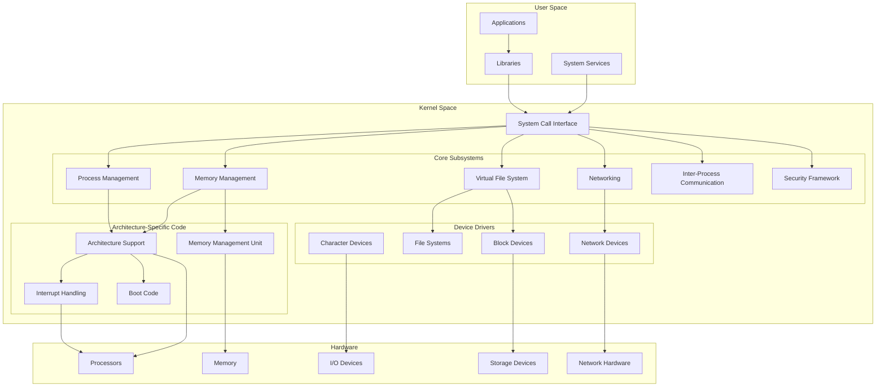
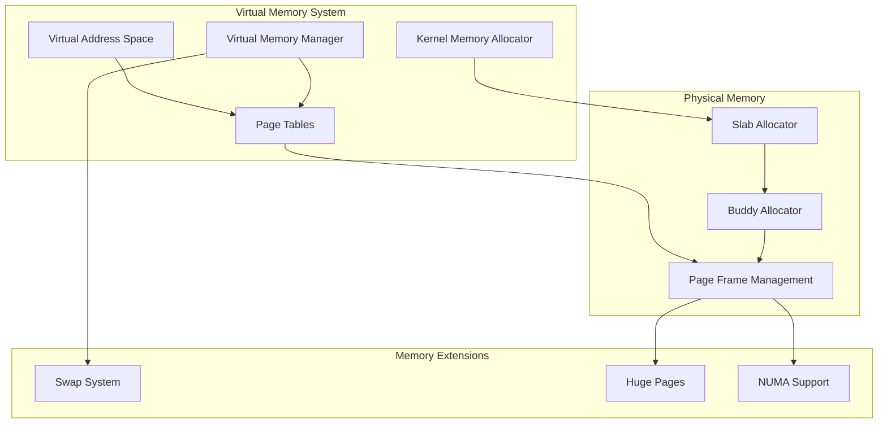
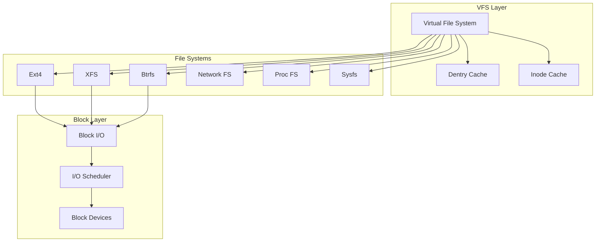

# Linux Kernel Architecture

This document outlines the high-level architecture of the Linux kernel, detailing how different components interact to provide a comprehensive operating system foundation.

## Overview

The Linux kernel is a monolithic kernel with modular capabilities. It manages system resources, provides hardware abstraction, and offers services to user-space applications. Its architecture is designed to balance performance, security, and flexibility across a wide range of hardware platforms.

## Architecture Diagram



## Component Descriptions

### User Space Components

- **Applications**: End-user programs that rely on kernel services via system calls
- **Libraries**: Provide abstractions and utilities for applications to interface with the kernel (e.g., glibc)
- **System Services**: Daemons and background processes that provide higher-level system functionality

### Kernel Space Components

#### System Call Interface

The System Call Interface (SCI) provides a stable API for user-space applications to request kernel services. It acts as the boundary between user and kernel space.

#### Core Subsystems

- **Process Management**: Handles process creation, scheduling, inter-process communication, and termination
- **Memory Management**: Manages physical and virtual memory, including page allocation, swapping, and memory protection
- **Virtual File System (VFS)**: Provides a unified interface to various file systems
- **Networking**: Implements network protocols, traffic management, and socket interfaces
- **Inter-Process Communication (IPC)**: Enables communication between processes through mechanisms like signals, pipes, and sockets
- **Security Framework**: Implements access control mechanisms, capabilities, and security modules like SELinux and AppArmor

#### Architecture-Specific Code

- **Architecture Support**: Hardware-specific code that adapts the kernel to different CPU architectures
- **Boot Code**: Architecture-specific initialization code executed during system startup
- **Memory Management Unit (MMU)**: Interfaces with hardware MMU for virtual memory management
- **Interrupt Handling**: Manages hardware interrupts and exception handling

#### Device Drivers

- **Character Devices**: Drivers for devices that handle data as streams of bytes (e.g., keyboards, serial ports)
- **Block Devices**: Drivers for devices that handle data in blocks (e.g., hard disks, SSDs)
- **Network Devices**: Drivers for network interfaces and related hardware
- **File Systems**: Implementations of various file systems (e.g., ext4, Btrfs, XFS)

### Hardware Layer

- **Processors**: CPUs (Central Processing Units) that execute instructions
- **Memory**: Physical RAM and other memory types
- **I/O Devices**: Input/Output devices like keyboards, displays, and peripherals
- **Storage Devices**: Hard drives, SSDs, and other persistent storage
- **Network Hardware**: Network interface cards and other networking equipment

## Kernel Design Principles

### Monolithic Design with Modularity

The Linux kernel follows a monolithic design where all kernel services operate in the same address space. This provides performance benefits through direct function calls. However, it also incorporates modularity through:

- **Loadable Kernel Modules**: Code that can be dynamically loaded and unloaded at runtime
- **Subsystem Independence**: Well-defined interfaces between major subsystems
- **Abstraction Layers**: Hardware abstraction to separate architecture-specific code

### Preemptive Multitasking

The kernel supports preemptive multitasking, allowing it to:
- Interrupt running processes to execute higher-priority tasks
- Provide fair CPU time allocation
- Handle real-time constraints
- Maintain system responsiveness

### Memory Management Architecture



### File System Architecture



## Kernel Source Tree Organization

The Linux kernel source code is organized into directories that roughly correspond to its architecture:

```
linux/
├── arch/           # Architecture-specific code
├── block/          # Block device layer
├── certs/          # Certificates for module signing
├── crypto/         # Cryptographic algorithms
├── Documentation/  # Kernel documentation
├── drivers/        # Device drivers
├── fs/             # File system implementations
├── include/        # Header files
├── init/           # Initialization code
├── io_uring/       # IO_uring interface
├── ipc/            # Inter-process communication
├── kernel/         # Core kernel code
├── lib/            # Library routines
├── LICENSES/       # License information
├── mm/             # Memory management
├── net/            # Networking code
├── rust/           # Rust language support
├── samples/        # Example code
├── scripts/        # Build and utility scripts
├── security/       # Security framework
├── sound/          # Sound subsystem
├── tools/          # Development tools
├── usr/            # Early userspace code
└── virt/           # Virtualization support
```
