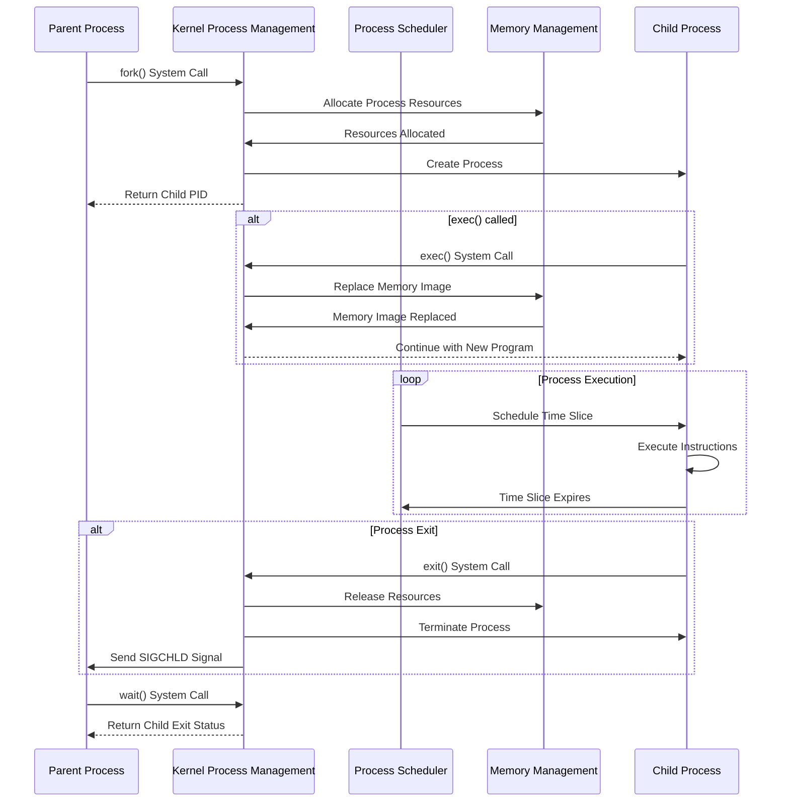
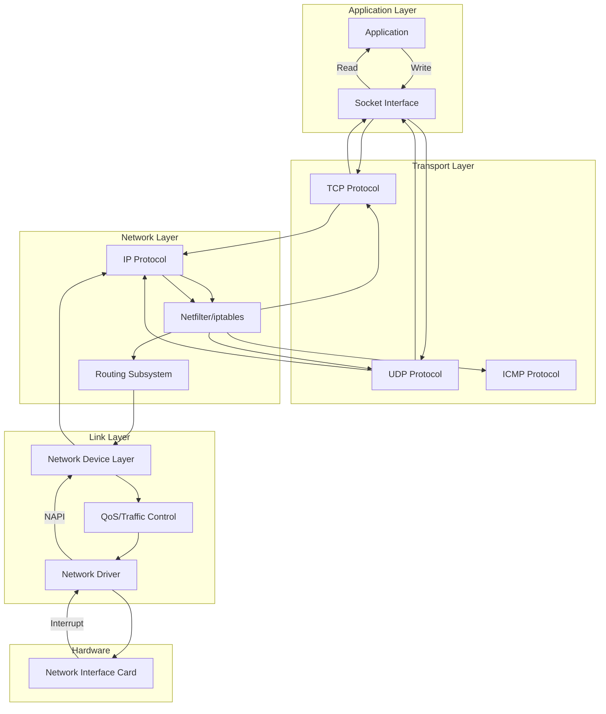
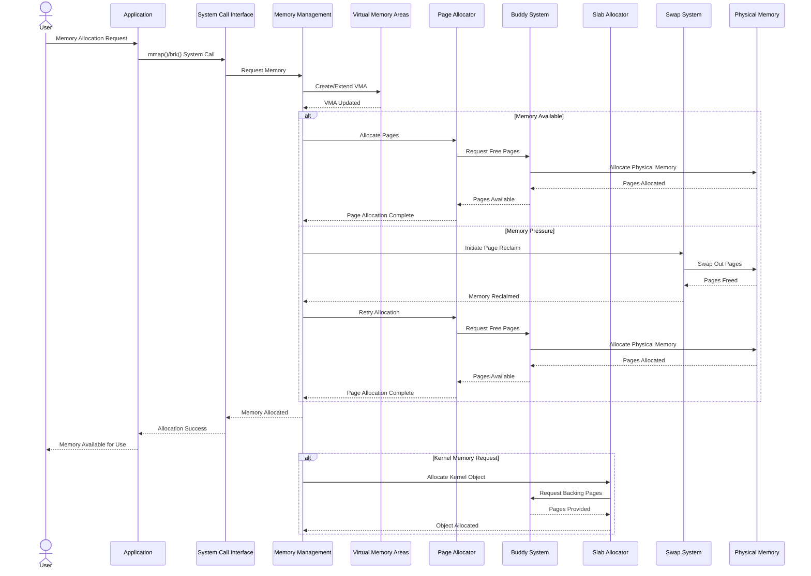
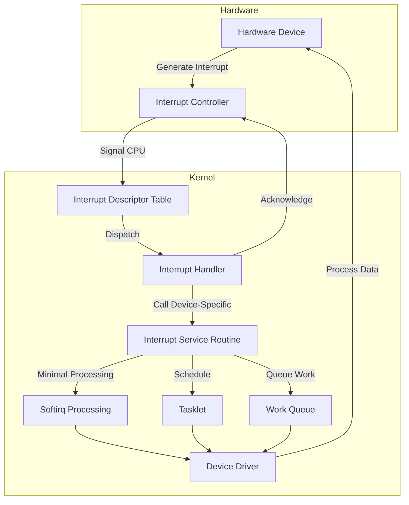

# Data Flow Diagrams

This document illustrates how data flows through the Linux kernel, from user applications to hardware and back.

## System Call Flow

The diagram below shows how user applications interact with the kernel through system calls.

```mermaid
flowchart TD
    User([User Application])
    
    subgraph "User Space"
        AppCode[Application Code]
        LibC[C Library/glibc]
    end
    
    subgraph "Kernel Space"
        SysCall[System Call Interface]
        Validation[Parameter Validation]
        KernelSvc[Kernel Service]
        Subsystems[Kernel Subsystems]
    end
    
    User --> AppCode
    AppCode --> LibC
    LibC --> SysCall
    
    SysCall --> Validation
    Validation --> KernelSvc
    KernelSvc --> Subsystems
    Subsystems --> KernelSvc
    KernelSvc --> SysCall
    SysCall --> LibC
    LibC --> AppCode
    AppCode --> User
```## I/O Data Flow

This diagram shows how data flows during I/O operations through the kernel's layers.

```mermaid
sequenceDiagram
    actor User
    participant App as Application
    participant VFS as Virtual File System
    participant FS as File System (e.g., ext4)
    participant Buffer as Buffer Cache
    participant Block as Block Layer
    participant Driver as Device Driver
    participant Device as Storage Device
    
    User->>App: Read File Request
    App->>VFS: read() System Call
    VFS->>FS: File System Read Operation
    
    alt Data in Cache
        FS->>Buffer: Check Buffer Cache
        Buffer-->>FS: Return Cached Data
    else Data not in Cache
        FS->>Buffer: Check Buffer Cache
        Buffer-->>FS: Cache Miss
        FS->>Block: Request Block Read
        Block->>Driver: Submit I/O Request
        Driver->>Device: Hardware Command
        Device-->>Driver: Data Transfer
        Driver-->>Block: I/O Completion
        Block-->>FS: Data Available
        FS->>Buffer: Update Buffer Cache
    end
    
    FS-->>VFS: Return Data
    VFS-->>App: System Call Return
    App-->>User: Display Data
```

## Process Lifecycle Flow

This diagram illustrates the lifecycle of a process within the Linux kernel.



## Networking Data Flow

This diagram shows how network data travels through the Linux kernel's networking stack.



## Memory Management Flow

This diagram illustrates how memory allocation requests are handled by the kernel.



## Interrupt Handling Flow

This diagram shows how the kernel processes hardware interrupts.


