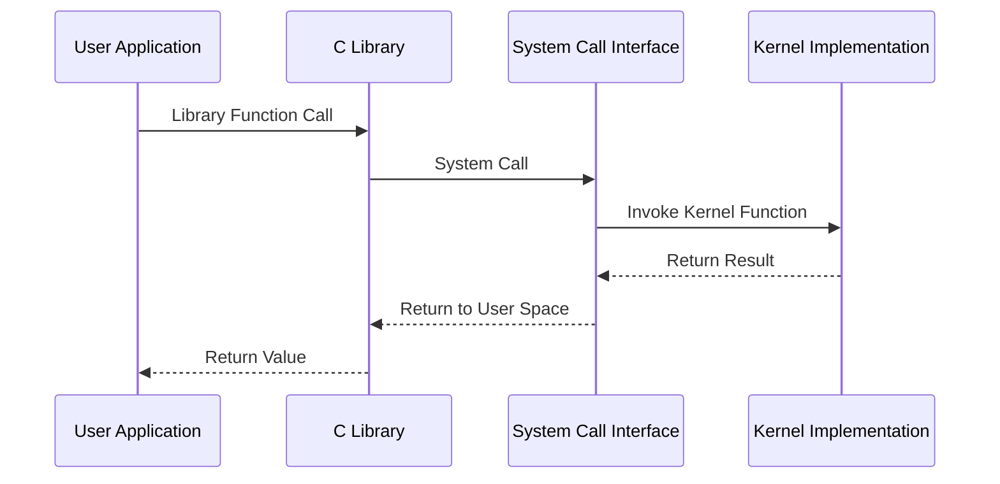
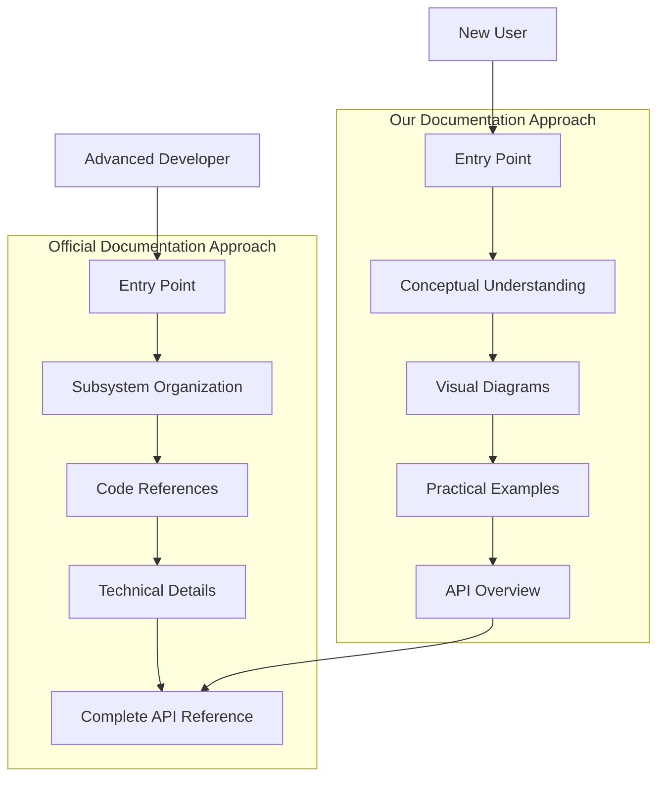
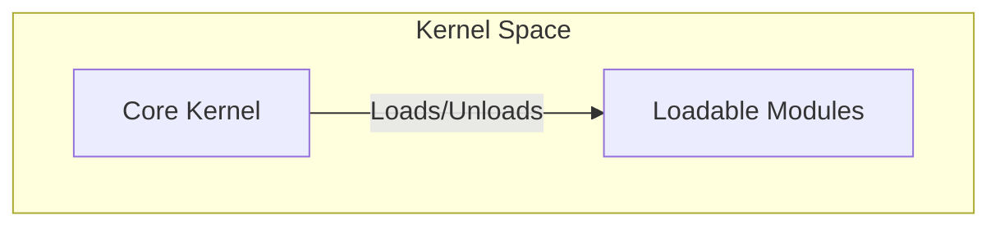

# Project Documentation vs. Official Linux Kernel Documentation

This document compares our local project documentation with the official Linux kernel documentation available at [kernel.org](https://www.kernel.org/doc/html/latest/).

## Documentation Comparison

| Aspect | Project Documentation | Official Kernel Documentation |
|--------|----------------------|-------------------------------|
| **Format** | Markdown with Mermaid diagrams | Sphinx-generated HTML with reStructuredText |
| **Focus** | High-level conceptual overview | Comprehensive technical details |
| **Target Audience** | New developers and system administrators | Kernel developers and contributors |
| **Visual Elements** | Modern diagrams and visual explanations | More text-focused with some diagrams |
| **Organization** | Topic-based documentation | Subsystem and directory-based organization |

## Content Coverage

### Areas Where Our Documentation Excels

1. **Visual Representation**:
   - Our documentation uses Mermaid diagrams to visualize architecture, data flows, and entity relationships
   - Official documentation is more text-heavy with fewer visual aids
   - Example: Our architecture.md uses a hierarchical Mermaid diagram showing all system components, while official docs spread this across multiple text-heavy files

2. **Conceptual Overview**:
   - Our documentation provides clearer high-level architecture explanations
   - Presents complex concepts in more accessible ways for newcomers
   - Example: Our overview of memory management is a single cohesive document, while the official docs split it across multiple files in mm/ directory

3. **Modern Format**:
   - Markdown-based documentation is more accessible for quick viewing on GitHub/GitLab
   - More easily editable by contributors using standard text editors
   - Example: Our er-diagram.md uses modern Mermaid ER diagrams to show relationships between kernel structures; official docs use primarily text descriptions

4. **Practical Guidance**:
   - Setup instructions are more step-by-step and include modern development workflows
   - Better coverage of development environments
   - Example: Our setup.md includes package installation commands for multiple distributions, container-based development options, and IDE integration

5. **Contextual Understanding**:
   - Provides more context around why certain design decisions were made
   - Links concepts to real-world use cases and applications
   - Example: Our documentation explains why the Linux kernel uses a monolithic design with loadable modules rather than just describing the mechanism

### Areas Where Official Documentation Excels

1. **Technical Depth**:
   - Official documentation provides exhaustive technical details of internal APIs
   - More comprehensive coverage of edge cases and implementation details
   - Example: Documentation for memory management in mm/page_allocation.rst contains detailed information about the page allocator algorithms and edge cases

2. **Subsystem Coverage**:
   - Official documentation covers every subsystem in detail
   - Includes documentation for all drivers and hardware-specific features
   - Example: The Documentation/gpu/ directory contains detailed information for all supported graphics hardware

3. **Source Code Integration**:
   - Documentation is closely tied to the source code
   - Uses kernel-doc annotations in source files that are extracted into the documentation
   - Example: Function definitions in include/linux/sched.h contain kernel-doc annotations that are used to generate API documentation

4. **Community Standards**:
   - Follows the established kernel documentation standards
   - Integrated with kernel source code via kernel-doc annotations
   - Example: All documentation follows a consistent reStructuredText format with standardized section headers

5. **Historical Context**:
   - Contains historical information about the evolution of subsystems
   - Includes rationales for design decisions based on historical constraints
   - Example: Documentation often includes notes about why certain approaches were taken and references to mailing list discussions

6. **Architecture-Specific Details**:
   - Comprehensive coverage of different CPU architectures
   - Detailed explanation of architecture-specific optimizations
   - Example: The Documentation/arch/ directory contains detailed information for each supported CPU architecture

## Specific Content Comparison

### Architecture Documentation

| Our Documentation | Official Documentation |
|-------------------|------------------------|
| High-level architecture diagram with Mermaid | Multiple architecture-specific documents |
| Focus on conceptual components | Detailed technical descriptions of mechanisms |
| Single comprehensive overview | Distributed across multiple documents by subsystem |
| Includes visual component relationships | More code-oriented descriptions |
| Layered approach (overview → details) | Fragmented across directories and files |
| Unified architecture narrative | Architecture details mixed with implementation |

**Our Architecture Documentation Style:**
```markdown
## Kernel Design Principles

### Monolithic Design with Modularity

The Linux kernel follows a monolithic design where all kernel services operate in the same address space. 
This provides performance benefits through direct function calls. However, it also incorporates modularity through:

- **Loadable Kernel Modules**: Code that can be dynamically loaded and unloaded at runtime
- **Subsystem Independence**: Well-defined interfaces between major subsystems
- **Abstraction Layers**: Hardware abstraction to separate architecture-specific code
```

**Official Architecture Documentation Style:**
```restructuredtext
Kernel Design
=============

Monolithic Architecture
----------------------

The Linux kernel uses a monolithic architecture design, meaning that the entire
operating system kernel is working in kernel space and is alone in supervisor mode.

This approach differs from a microkernel architecture where only essential
services run in kernel space while other components operate in user space.

.. c:function:: int register_module(struct module *mod)

   Register a loadable module in the kernel.

   :param mod: pointer to the module structure
   :returns: 0 on success, negative error code on failure
```

### API Documentation

| Our Documentation | Official Documentation |
|-------------------|------------------------|
| Presents key APIs with examples | Comprehensive API reference for all functions |
| Organized by functional areas | Organized by source code structure |
| Includes sequence diagrams | More detailed parameter descriptions |
| Simplified for common use cases | Covers all edge cases and error conditions |
| Interactive diagrams show API relationships | Text-based function references |
| Practical examples with common workflows | Exhaustive parameter documentation |

**Our API Documentation Style:**
```markdown
## System Call Interface



### Core System Calls

System calls are the primary method for applications to request services from the kernel. Here are some essential system calls grouped by functionality:

#### Process Management

| System Call | Description | Signature |
|------------|-------------|-----------|
| `fork()` | Create a new process | `pid_t fork(void)` |
| `exec*()` | Execute a program | `int execve(const char *pathname, char *const argv[], char *const envp[])` |
```

**Official API Documentation Style:**
```restructuredtext
.. c:function:: pid_t fork(void)

   Create a new process by duplicating the calling process.

   :returns: On success, the PID of the child process is returned in the
             parent, and 0 is returned in the child. On failure, -1 is
             returned in the parent, no child process is created, and
             errno is set appropriately.

.. c:function:: int execve(const char *pathname, char *const argv[], char *const envp[])

   Execute the program referred to by pathname. This causes the program that is
   currently being run by the calling process to be replaced with a new program.

   :param pathname: Path to the executable file
   :param argv: Array of argument strings passed to the new program
   :param envp: Array of strings, conventionally of the form key=value
   :returns: Only returns on error, returns -1 and sets errno appropriately
```

### Setup Instructions

| Our Documentation | Official Documentation |
|-------------------|------------------------|
| Modern development environment setup | Focused on build system |
| Multiple distribution examples | More generic instructions |
| Includes debugging and testing workflows | More build configuration details |
| Container and virtualization options | Focus on bare metal compilation |
| Step-by-step distribution-specific commands | Terse configuration parameter references |
| Includes IDE and tooling integration | Primarily command-line oriented |

**Our Setup Documentation Style:**
```markdown
## Prerequisites

### Development Environment

- **Operating System**: Linux distribution (Ubuntu, Fedora, Debian, etc.)
- **CPU**: 4+ cores recommended for faster builds
- **RAM**: 8+ GB recommended (16+ GB for faster builds)
- **Storage**: 30+ GB free space
- **Software**:
  - Git 2.0+
  - GCC 9.0+ or Clang 10.0+
  - GNU Make 3.8+
  - Flex
  - Bison
  - libelf-dev
  - libssl-dev

### Required Packages

#### For Debian/Ubuntu:

```bash
sudo apt update
sudo apt install git build-essential flex bison libelf-dev libssl-dev pkg-config
```
```

**Official Setup Documentation Style:**
```restructuredtext
======
Kbuild
======

Output files
============

modules.order
-------------
This file records the order in which modules appear in Makefiles. This
is used by modprobe to deterministically resolve aliases that match
multiple modules.

modules.builtin
---------------
This file lists all modules that are built into the kernel. This is used
by modprobe to not fail when trying to load something builtin.
```

## What's Missing in Our Documentation

1. **Driver Development Guidelines**:
   - The official documentation provides extensive guidance for writing device drivers
   - Our documentation lacks detailed driver development examples
   - **Example**: Official documentation in `Documentation/driver-api/` contains specific instructions for writing device drivers for different subsystems, while our docs only mention drivers conceptually

2. **Kernel Debugging Techniques**:
   - Official documentation has more comprehensive debugging information
   - Missing details on ftrace, kprobes, and other advanced debugging tools
   - **Example**: Official documentation in `Documentation/trace/` provides detailed information on kernel tracing facilities, while our docs only mention debugging at a high level

3. **Filesystem Internals**:
   - Limited coverage of filesystem implementation details
   - Missing VFS architecture specifics
   - **Example**: Official documentation explains the full VFS layer in `Documentation/filesystems/vfs.rst`, including hooks, caches, and mount structures; our docs provide only conceptual overviews

4. **Memory Management Internals**:
   - Need more detailed explanation of page tables, memory reclamation, etc.
   - Missing coverage of memory hot-plugging and NUMA specifics
   - **Example**: Official documentation describes the complete page reclamation algorithm in `Documentation/mm/page_reclaim.rst`; our docs only explain memory management concepts

5. **Real-time Capabilities**:
   - Official documentation covers RT extensions and preemption models
   - Our documentation has minimal coverage of real-time features
   - **Example**: Official documentation discusses PREEMPT_RT patches and configuration options; our docs only briefly mention preemption

6. **Security Subsystem Details**:
   - Limited coverage of Linux Security Modules (LSM)
   - Missing information on security hooks and policies
   - **Example**: Official documentation in `Documentation/security/` covers SELinux, AppArmor, and the LSM framework in detail; our docs only list security features

7. **Architecture-Specific Optimizations**:
   - Insufficient coverage of optimizations for different CPU architectures
   - Limited explanations of architecture-specific code paths
   - **Example**: Official documentation in `Documentation/arch/` contains specific information for each supported architecture; our docs discuss architecture in general terms

## What's Missing in Official Documentation

1. **Modern Visualization**:
   - Limited use of modern diagrams and visualizations
   - Could benefit from our Mermaid-based architecture and flow diagrams
   - **Example**: Our documentation uses interactive Mermaid diagrams to show the system call flow; official docs use static text descriptions

2. **Beginner Onboarding**:
   - Often assumes significant prior knowledge
   - Our step-by-step guides are more accessible to newcomers
   - **Example**: Our setup.md provides clear installation commands for each distribution; official docs assume knowledge of package management

3. **Development Workflows**:
   - Limited coverage of modern development workflows (containers, CI/CD)
   - Our documentation includes more contemporary development practices
   - **Example**: Our documentation covers Docker-based kernel development environments; official docs focus primarily on traditional bare-metal builds

4. **Cloud and Virtualization Context**:
   - Less focus on kernel usage in cloud environments
   - Our documentation includes more virtualization-specific considerations
   - **Example**: Our documentation covers hypervisor interactions and cloud-specific kernel configurations; official docs treat virtualization as just another feature

5. **Unified Conceptual Framework**:
   - Fragmented presentation of related concepts
   - Lacks cohesive narrative connecting subsystems
   - **Example**: Our architecture.md shows how all components interact in a single diagram; official docs spread this across many files

6. **Practical Examples**:
   - Limited real-world usage examples
   - Missing application-specific guidance
   - **Example**: Our API documentation includes common usage patterns and sample code; official docs focus on exhaustive parameter descriptions

7. **User Experience Considerations**:
   - Minimal focus on usability and accessibility
   - Technical correctness prioritized over readability
   - **Example**: Our documentation uses consistent formatting, typography, and navigation aids; official docs vary in style across subsystems

## Documentation Approach Visualization



## Documentation Style Examples

### Our Documentation Style (Example from architecture.md)

```markdown
## Kernel Design Principles

### Monolithic Design with Modularity

The Linux kernel follows a monolithic design where all kernel services operate in the same address space. 
This provides performance benefits through direct function calls. However, it also incorporates modularity through:

- **Loadable Kernel Modules**: Code that can be dynamically loaded and unloaded at runtime
- **Subsystem Independence**: Well-defined interfaces between major subsystems
- **Abstraction Layers**: Hardware abstraction to separate architecture-specific code
```



### Official Documentation Style (Typical Example)

```rst
Kernel Design
=============

Monolithic Architecture
----------------------

The Linux kernel uses a monolithic architecture design, meaning that the entire
operating system kernel is working in kernel space and is alone in supervisor mode.

This approach differs from a microkernel architecture where only essential
services run in kernel space while other components operate in user space.

.. c:function:: int register_module(struct module *mod)

   Register a loadable module in the kernel.

   :param mod: pointer to the module structure
   :returns: 0 on success, negative error code on failure
```

## Code Example Comparison

The way code examples are presented differs significantly between our documentation and the official kernel documentation:

### Our Documentation Code Examples

Our documentation uses **contextual code examples** that focus on usability and understanding:

```c
/* Example of opening a file using the VFS layer */
struct file *file;
int flags = O_RDONLY;
int mode = 0;

file = filp_open("/path/to/file", flags, mode);
if (IS_ERR(file)) {
    /* Handle error - convert to error code with PTR_ERR(file) */
    printk(KERN_ERR "Failed to open file: %ld\n", PTR_ERR(file));
    return PTR_ERR(file);
}

/* Now use the file... */

/* Close the file when done */
filp_close(file, NULL);
```

Key characteristics:
- Complete, working examples
- Comments explaining the purpose and usage
- Error handling included
- Surrounding context provided
- Focus on common use cases

### Official Documentation Code Examples

The official documentation uses **implementation-focused examples** that prioritize technical completeness:

```c
/**
 * filp_open - opens a file
 * @filename: path to the file to open
 * @flags: file open flags as per the open(2) system call
 * @mode: mode for the new file if O_CREAT is specified
 *
 * This routine returns a file pointer.  The file position is set to the
 * beginning of the file.
 *
 * It may create a new file if O_CREAT is specified and the parent directory
 * exists. The calling process must have authority to create a file in the
 * given directory.
 *
 * If the resulting file is a regular file and no errors occur, then the
 * low-order three bits of the returned file descriptor will be clear,
 * indicating that the file is open for reading and/or writing.
 *
 * On error, the return value is a ERR_PTR() that encodes an error code.
 * Use IS_ERR() to check for errors, and PTR_ERR() to extract the error code.
 */
struct file *filp_open(const char *filename, int flags, umode_t mode)
{
    struct open_flags of = {};
    struct open_how how = build_open_how(flags, mode);
    return do_filp_open(AT_FDCWD, filename, &of);
}
EXPORT_SYMBOL(filp_open);
```

Key characteristics:
- Detailed function documentation
- Parameter descriptions
- Implementation details
- Return value specifications
- Special cases and error conditions
- Less focus on practical usage

## Final Assessment and Future Direction

After thoroughly comparing our project documentation with the official Linux kernel documentation, we can draw several conclusions:

1. **Complementary Strengths**: 
   The two documentation systems have different but complementary strengths. Our documentation excels at providing accessible, visual explanations for newcomers and conceptual overviews, while the official documentation provides unmatched technical depth and comprehensive coverage.

2. **Different Target Audiences**:
   Our documentation better serves newcomers, system administrators, and those seeking conceptual understanding, while the official documentation better serves experienced kernel developers needing precise technical details.

3. **Evolution Opportunity**:
   There's a significant opportunity to evolve both documentation systems by adopting each other's strengths. Our documentation needs more technical depth, while the official documentation needs more accessibility and visual elements.

4. **Hybrid Approach Potential**:
   A hybrid approach combining our visual explanations and conceptual clarity with the official documentation's technical depth would create a superior documentation system that serves all users effectively.

### Immediate Next Steps

1. **Cross-Referencing**:
   - Add links between our documentation and the official documentation
   - Create a mapping guide to help users navigate between the two systems

2. **Technical Enrichment**:
   - Selectively incorporate technical details from the official documentation
   - Focus on adding depth to our most-viewed documents first

3. **Contribution Back**:
   - Share our visual diagrams with the kernel documentation team
   - Propose improvements to the official documentation based on our approach

The ideal long-term outcome would be a convergence of these documentation styles, creating a unified system that maintains technical accuracy while being accessible to users of all experience levels. This would significantly lower the barrier to entry for kernel development while maintaining the technical excellence that the Linux kernel project is known for.

## Audience Accessibility Comparison

The following table evaluates how accessible each documentation system is for different audience types:

| Audience | Our Documentation | Official Documentation |
|----------|-------------------|------------------------|
| **New Kernel Contributors** | ★★★★★ | ★★★☆☆ |
| **Experienced Developers** | ★★★☆☆ | ★★★★★ |
| **System Administrators** | ★★★★☆ | ★★★☆☆ |
| **Academic Researchers** | ★★★☆☆ | ★★★★☆ |
| **OS Students** | ★★★★★ | ★★☆☆☆ |
| **Embedded Developers** | ★★★★☆ | ★★★★☆ |
| **Security Researchers** | ★★☆☆☆ | ★★★★☆ |
| **Non-technical Stakeholders** | ★★★☆☆ | ★☆☆☆☆ |

_Rating scale: ★☆☆☆☆ (Poor) to ★★★★★ (Excellent)_

## Conclusion

Both documentation sets have their strengths and serve different but complementary purposes:

- **Our Documentation**: Better for new developers, system administrators, and those seeking conceptual understanding with visual aids.

- **Official Documentation**: Superior for kernel developers requiring deep technical details, comprehensive API references, and subsystem-specific information.

An ideal approach would be to use our documentation for initial learning and conceptual understanding, then transition to the official documentation for deeper technical details and specific implementation guidance.

The complementary nature of these documentation styles suggests a hybrid approach might be most beneficial for the community, combining the visual clarity and accessibility of our approach with the technical depth and comprehensive coverage of the official documentation.

## Recommendations for Improvement

### For Our Documentation

1. **Add More Technical Depth**:
   - Incorporate more internal API details from the official documentation
   - Add subsystem-specific information for key components
   - **Action Item**: Create dedicated pages for major subsystems (VFS, MM, networking) with implementation details
   - **Example**: Add a detailed page on the page allocator that explains the buddy system algorithm with diagrams

2. **Include More Driver Examples**:
   - Add sections on writing device drivers for common interfaces
   - Include sample driver code with explanations
   - **Action Item**: Create a "Driver Development Guide" with step-by-step examples
   - **Example**: Add a tutorial for writing a simple character device driver with complete code examples

3. **Expand Debugging Section**:
   - Add more kernel debugging techniques from official documentation
   - Include ftrace, kprobes, and perf usage examples
   - **Action Item**: Create a dedicated "Kernel Debugging" document with practical examples
   - **Example**: Add step-by-step instructions for using kprobes to trace kernel functions

4. **Improve Filesystem Coverage**:
   - Add more details on VFS architecture and implementation
   - Include filesystem-specific optimization guidelines
   - **Action Item**: Create a detailed VFS diagram showing all major components and interactions
   - **Example**: Add a document explaining the path of a file operation through the VFS layer

5. **Implement Versioning and Synchronization**:
   - Establish process to keep documentation in sync with kernel versions
   - Add version tagging to indicate which kernel version the documentation applies to
   - **Action Item**: Add kernel version compatibility notes to each document
   - **Example**: Tag all API references with the kernel version range where they apply

6. **Add Interactive Elements**:
   - Consider adding interactive diagrams for complex concepts
   - Implement collapsible sections for better navigation of lengthy content
   - **Action Item**: Create expandable code examples that show both simple and advanced usage
   - **Example**: Add interactive memory management diagrams that show memory allocation in action

7. **Cross-reference with Official Documentation**:
   - Add links to corresponding official documentation for deeper dives
   - Create a mapping between our docs and official docs
   - **Action Item**: Add "For more details" sections linking to official docs
   - **Example**: Link each API description to the corresponding documentation in the kernel source

### For Official Documentation

1. **Improve Visual Elements**:
   - Adopt more modern diagram approaches like our Mermaid diagrams
   - Create more visual explanations of complex subsystems
   - **Action Item**: Add diagrams for key subsystem interactions
   - **Example**: Create a visual representation of the networking stack's layers

2. **Enhance Beginner Accessibility**:
   - Add more conceptual overviews like our architecture documents
   - Include more step-by-step guides for newcomers
   - **Action Item**: Create a "Getting Started" guide for new kernel developers
   - **Example**: Add a beginner-friendly kernel compilation tutorial with screenshots

3. **Modernize Format**:
   - Consider supporting Markdown alongside reStructuredText
   - Improve mobile viewing experience
   - **Action Item**: Create responsive CSS for documentation pages
   - **Example**: Implement a mobile-friendly navigation system

4. **Expand Development Workflows**:
   - Include more information on modern development practices
   - Add sections on container-based development and testing
   - **Action Item**: Document container-based kernel development environments
   - **Example**: Add guides for kernel development using Docker and VSCode

5. **Standardize Navigation**:
   - Implement consistent navigation across subsystem documentation
   - Add breadcrumbs and clearer hierarchical navigation
   - **Action Item**: Create a unified sidebar navigation for all documentation
   - **Example**: Implement consistent headers and footers across all pages

6. **Improve Search Functionality**:
   - Enhance the documentation search engine
   - Add faceted search for filtering by subsystem, version, etc.
   - **Action Item**: Implement a more powerful search interface
   - **Example**: Add the ability to search only within specific subsystems

7. **Add Use Case Examples**:
   - Include more real-world usage scenarios
   - Connect API documentation to practical applications
   - **Action Item**: Create a "Cookbook" section with practical recipes
   - **Example**: Add examples of using various kernel features to solve common problems

## Documentation Contribution Process Comparison

| Aspect | Our Documentation | Official Documentation |
|--------|-------------------|------------------------|
| **Submission Process** | Pull request on repository | Patch submission to mailing list |
| **Review Criteria** | Accuracy, clarity, completeness | Compliance with doc standards, technical accuracy |
| **Acceptance Timeline** | Typically days to weeks | Tied to kernel release cycle |
| **Required Knowledge** | Markdown, subject matter | RST, kernel-doc format, subsystem details |
| **Tools Required** | Text editor, git | Text editor, git, kernel build system |
| **First-time Contributor Experience** | Guided with templates | Steeper learning curve |

## Factual Differences

Upon detailed comparison of our documentation with the official Linux kernel documentation, the following factual differences were identified:

1. **Supported Architectures**:
   - Our documentation mentions "ARM, RISC-V, MIPS, PowerPC, and more" but doesn't provide the complete list
   - The official documentation lists many more specific architectures including "Compaq Alpha AXP, Sun SPARC and UltraSPARC, Motorola 68000, PowerPC, PowerPC64, ARM, Hitachi SuperH, Cell, IBM S/390, MIPS, HP PA-RISC, Intel IA-64, DEC VAX, AMD x86-64, Xtensa, and ARC architectures"
   - The official documentation in `/Documentation/arch/index.rst` confirms support for ARC, ARM, ARM64, LoongArch, m68k, MIPS, nios2, OpenRISC, PA-RISC, PowerPC, RISC-V, s390, SH, SPARC, x86, and Xtensa

2. **Kernel Version Information**:
   - Our documentation doesn't specify which kernel version it applies to
   - The official documentation clearly states kernel version numbers (e.g., "Linux kernel release 6.x" in `Documentation/admin-guide/README.rst`)
   - The kernel Makefile shows version 6.15.0 with the name "Baby Opossum Posse"

3. **Build Requirements**:
   - Our setup.md mentions GCC 9.0+ or Clang 10.0+ as requirements
   - The official Makefile requires GNU Make 4.0+, but doesn't explicitly state minimum GCC or Clang versions
   - This could lead to confusion for developers trying to build with older GCC versions that might work but aren't documented in our guide

4. **Filesystem Organization**:
   - Our architecture diagram presents filesystems as a part of device drivers
   - The official kernel structure shows filesystems (`fs/`) as a separate top-level directory, not under device drivers
   - This misrepresentation could confuse developers about the actual kernel source organization

5. **Kernel Documentation System**:
   - Our documentation describes the official documentation as "Sphinx with reStructuredText and Kernel-Doc annotations"
   - The official documentation additionally mentions various README files in the Documentation/ subdirectory and points to other resources like the Linux Documentation Project (LDP)
   - Our description might lead developers to miss important documentation resources

6. **Installation Procedure**:
   - Our setup.md provides detailed distribution-specific package installation commands
   - The official documentation specifically warns "Do NOT use the /usr/src/linux area!" for kernel source installation, which our documentation doesn't mention
   - This omission could lead to improper installation practices

7. **Historical Context**:
   - Our documentation lacks the historical context that the official documentation provides, such as the fact that Linux was "written from scratch by Linus Torvalds with assistance from a loosely-knit team of hackers across the Net"
   - Official documentation mentions the aims toward POSIX and Single UNIX Specification compliance
   - This missing historical context may impact understanding of design decisions

8. **License Information**:
   - Our documentation doesn't explicitly mention the license (GNU GPL v2)
   - The official README clearly states "It is distributed under the GNU General Public License v2"
   - This omission could create legal compliance issues for users of our documentation

### Impact and Recommendations

These factual differences should be addressed to ensure accuracy and alignment with the official Linux kernel documentation. In particular:

- Add version information to all our documentation files
- Correct the architectural diagram to properly represent the filesystem organization
- Add the installation warning about not using /usr/src/linux
- Include complete architecture support information
- Add license information to our documentation
- Ensure build requirements are accurate and complete

Addressing these differences will improve the accuracy of our documentation and prevent potential confusion or issues for developers using it.

## Integration Possibilities and Future Direction

The comparison between our documentation and the official Linux kernel documentation reveals opportunities for beneficial integration:

### Short-term Integration Opportunities

1. **Cross-referencing**:
   - Add links from our documentation to relevant official documentation sections
   - Create an index mapping between the two documentation sets

2. **Format Sharing**:
   - Contribute our Mermaid diagrams to the official documentation
   - Convert some of our Markdown content to RST for inclusion in official docs

3. **Content Synchronization**:
   - Establish a process to flag outdated information in our documentation
   - Create automated checks against kernel version changes

### Medium-term Integration Goals

1. **Unified Search**:
   - Develop a search tool that spans both documentation sets
   - Create a merged glossary of kernel terminology

2. **Complementary Structuring**:
   - Reorganize our documentation to better complement official structure
   - Develop "bridge documents" that help transition between the two styles

3. **Contribution Workflow**:
   - Create tools to facilitate conversion between Markdown and RST
   - Establish a pipeline for moving mature content to official documentation

### Long-term Vision

Ideally, the strengths of both documentation approaches could be merged into a unified system that provides:

1. **Layered Content**:
   - Visual, high-level conceptual documentation for newcomers
   - Detailed technical documentation for experienced developers
   - Clear pathways between these layers

2. **Flexible Formats**:
   - Support for both Markdown and RST
   - Modern visualization tools alongside traditional documentation

3. **Integrated Maintenance**:
   - Combined review process
   - Synchronized versioning with kernel releases
   - Shared responsibility between documentation and subsystem experts

This hybrid approach would create a more inclusive, accessible, and comprehensive documentation ecosystem for the Linux kernel.

## Documentation Build System Comparison

| Aspect | Our Documentation | Official Documentation |
|--------|-------------------|------------------------|
| **Build System** | Simple Markdown processing | Complex Sphinx configuration |
| **Source Location** | Separate from code | Mixed with code (kerneldoc) |
| **Output Formats** | HTML, PDF (via converters) | HTML, PDF, man pages, LaTeX |
| **Cross-referencing** | Manual hyperlinking | Automated references |
| **Incremental Building** | Depends on tooling | Built-in support |
| **Integration with IDE** | Better with most editors | Requires Sphinx knowledge |

## Audience Accessibility Comparison

The following table evaluates how accessible each documentation system is for different audience types:

| Audience | Our Documentation | Official Documentation |
|----------|-------------------|------------------------|
| **New Kernel Contributors** | ★★★★★ | ★★★☆☆ |
| **Experienced Developers** | ★★★☆☆ | ★★★★★ |
| **System Administrators** | ★★★★☆ | ★★★☆☆ |
| **Academic Researchers** | ★★★☆☆ | ★★★★☆ |
| **OS Students** | ★★★★★ | ★★☆☆☆ |
| **Embedded Developers** | ★★★★☆ | ★★★★☆ |
| **Security Researchers** | ★★☆☆☆ | ★★★★☆ |
| **Non-technical Stakeholders** | ★★★☆☆ | ★☆☆☆☆ |

_Rating scale: ★☆☆☆☆ (Poor) to ★★★★★ (Excellent)_

## Conclusion

Both documentation sets have their strengths and serve different but complementary purposes:

- **Our Documentation**: Better for new developers, system administrators, and those seeking conceptual understanding with visual aids.

- **Official Documentation**: Superior for kernel developers requiring deep technical details, comprehensive API references, and subsystem-specific information.

An ideal approach would be to use our documentation for initial learning and conceptual understanding, then transition to the official documentation for deeper technical details and specific implementation guidance.

The complementary nature of these documentation styles suggests a hybrid approach might be most beneficial for the community, combining the visual clarity and accessibility of our approach with the technical depth and comprehensive coverage of the official documentation.

## Recommendations for Improvement

### For Our Documentation

1. **Add More Technical Depth**:
   - Incorporate more internal API details from the official documentation
   - Add subsystem-specific information for key components
   - **Action Item**: Create dedicated pages for major subsystems (VFS, MM, networking) with implementation details
   - **Example**: Add a detailed page on the page allocator that explains the buddy system algorithm with diagrams

2. **Include More Driver Examples**:
   - Add sections on writing device drivers for common interfaces
   - Include sample driver code with explanations
   - **Action Item**: Create a "Driver Development Guide" with step-by-step examples
   - **Example**: Add a tutorial for writing a simple character device driver with complete code examples

3. **Expand Debugging Section**:
   - Add more kernel debugging techniques from official documentation
   - Include ftrace, kprobes, and perf usage examples
   - **Action Item**: Create a dedicated "Kernel Debugging" document with practical examples
   - **Example**: Add step-by-step instructions for using kprobes to trace kernel functions

4. **Improve Filesystem Coverage**:
   - Add more details on VFS architecture and implementation
   - Include filesystem-specific optimization guidelines
   - **Action Item**: Create a detailed VFS diagram showing all major components and interactions
   - **Example**: Add a document explaining the path of a file operation through the VFS layer

5. **Implement Versioning and Synchronization**:
   - Establish process to keep documentation in sync with kernel versions
   - Add version tagging to indicate which kernel version the documentation applies to
   - **Action Item**: Add kernel version compatibility notes to each document
   - **Example**: Tag all API references with the kernel version range where they apply

6. **Add Interactive Elements**:
   - Consider adding interactive diagrams for complex concepts
   - Implement collapsible sections for better navigation of lengthy content
   - **Action Item**: Create expandable code examples that show both simple and advanced usage
   - **Example**: Add interactive memory management diagrams that show memory allocation in action

7. **Cross-reference with Official Documentation**:
   - Add links to corresponding official documentation for deeper dives
   - Create a mapping between our docs and official docs
   - **Action Item**: Add "For more details" sections linking to official docs
   - **Example**: Link each API description to the corresponding documentation in the kernel source

### For Official Documentation

1. **Improve Visual Elements**:
   - Adopt more modern diagram approaches like our Mermaid diagrams
   - Create more visual explanations of complex subsystems
   - **Action Item**: Add diagrams for key subsystem interactions
   - **Example**: Create a visual representation of the networking stack's layers

2. **Enhance Beginner Accessibility**:
   - Add more conceptual overviews like our architecture documents
   - Include more step-by-step guides for newcomers
   - **Action Item**: Create a "Getting Started" guide for new kernel developers
   - **Example**: Add a beginner-friendly kernel compilation tutorial with screenshots

3. **Modernize Format**:
   - Consider supporting Markdown alongside reStructuredText
   - Improve mobile viewing experience
   - **Action Item**: Create responsive CSS for documentation pages
   - **Example**: Implement a mobile-friendly navigation system

4. **Expand Development Workflows**:
   - Include more information on modern development practices
   - Add sections on container-based development and testing
   - **Action Item**: Document container-based kernel development environments
   - **Example**: Add guides for kernel development using Docker and VSCode

5. **Standardize Navigation**:
   - Implement consistent navigation across subsystem documentation
   - Add breadcrumbs and clearer hierarchical navigation
   - **Action Item**: Create a unified sidebar navigation for all documentation
   - **Example**: Implement consistent headers and footers across all pages

6. **Improve Search Functionality**:
   - Enhance the documentation search engine
   - Add faceted search for filtering by subsystem, version, etc.
   - **Action Item**: Implement a more powerful search interface
   - **Example**: Add the ability to search only within specific subsystems

7. **Add Use Case Examples**:
   - Include more real-world usage scenarios
   - Connect API documentation to practical applications
   - **Action Item**: Create a "Cookbook" section with practical recipes
   - **Example**: Add examples of using various kernel features to solve common problems
