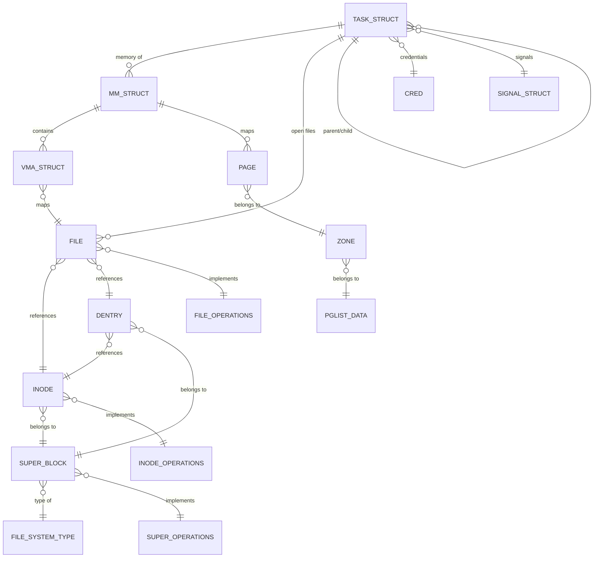
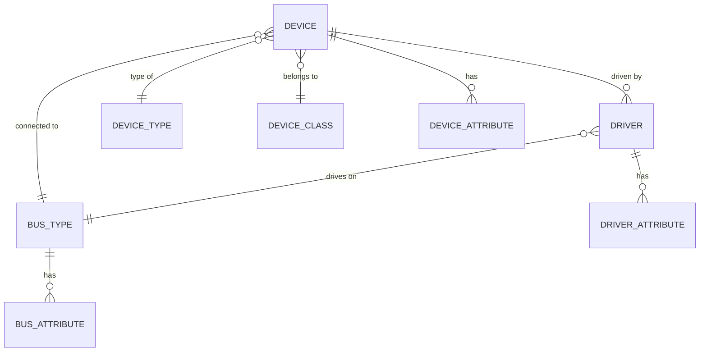
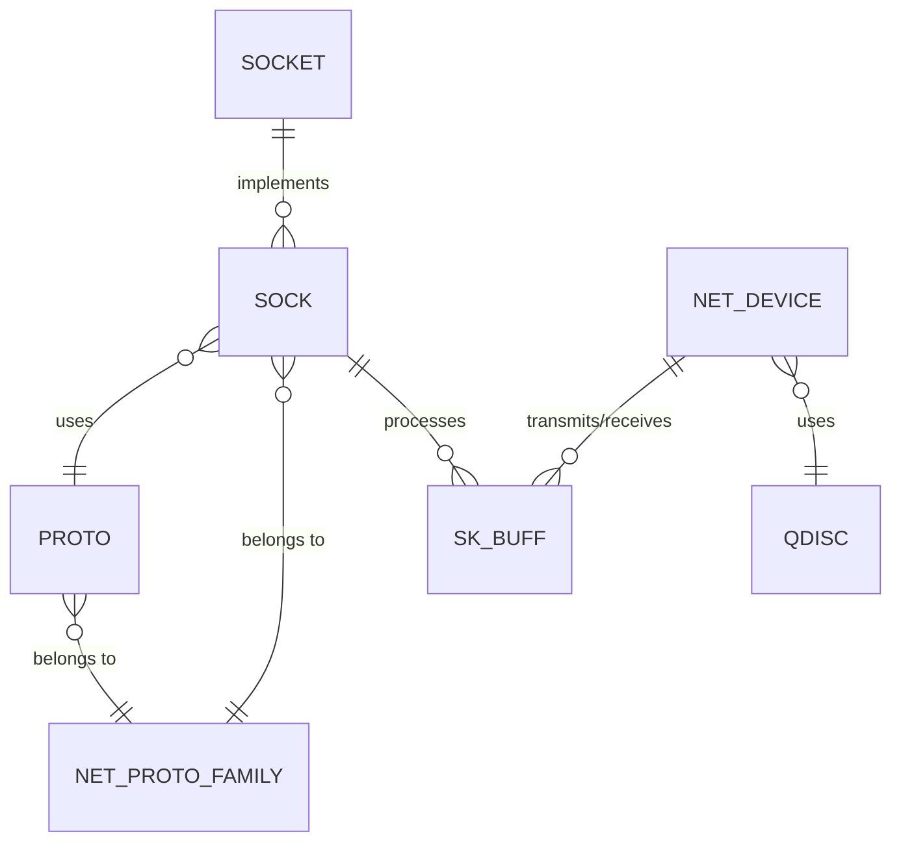
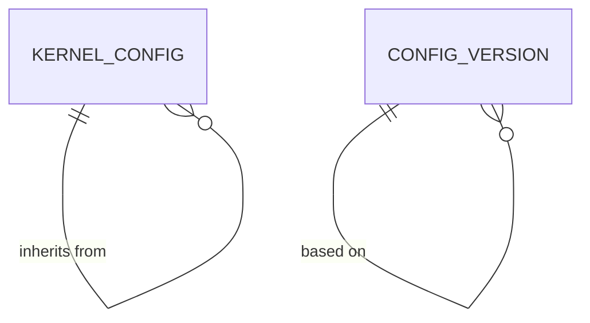
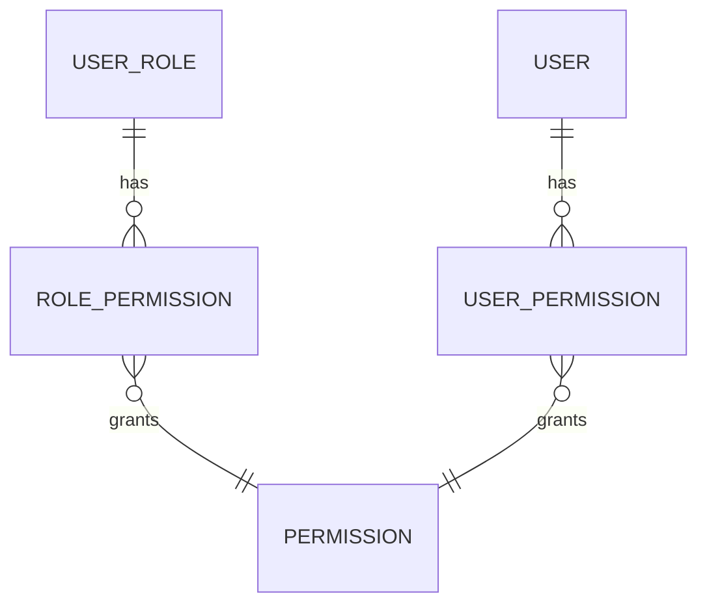

# Linux Kernel Data Structures

This document describes the key data structures and their relationships within the Linux kernel.

## Overview

The Linux kernel uses numerous interconnected data structures to represent and manage system resources. These structures are not database entities in the traditional sense but are in-memory representations that define how the kernel organizes and accesses resources.

## Core Kernel Data Structures

### Core Data Structure Details

- **TASK_STRUCT**: Process/thread info (PID, state, memory mappings, open files)
- **MM_STRUCT**: Memory management structure (code/data segments, heap, stack)
- **VMA_STRUCT**: Virtual memory areas with specific permissions
- **FILE**: Open file representation with position and mode
- **DENTRY**: Directory entry cache connecting paths to inodes
- **INODE**: File metadata (permissions, size, location)
- **SUPER_BLOCK**: Mounted filesystem information
- **PAGE**: Physical memory page tracking
- **ZONE**: Memory zone management (DMA, normal, highmem)

## Device and Driver Data Structures

### Device Model Details

- **DEVICE**: Physical/virtual device representation
- **DRIVER**: Driver code and operations for devices
- **BUS_TYPE**: Communication channel (PCI, USB, etc.)
- **DEVICE_TYPE**: Device classification by function
- **DEVICE_CLASS**: Grouping of similar devices
- **ATTRIBUTE**: Properties exposed via sysfs

## Network Stack Data Structures

### Network Stack Details

- **SOCKET**: User-space interface for network communications
- **SOCK**: Internal socket implementation
- **PROTO**: Protocol implementation (TCP, UDP, etc.)
- **NET_PROTO_FAMILY**: Protocol family (IPv4, IPv6, Unix)
- **SK_BUFF**: Socket buffer for packet data
- **NET_DEVICE**: Network interface abstraction
- **QDISC**: Queue discipline for packet scheduling

## Key Data Structure Descriptions

### Process Management

- **TASK_STRUCT**: Represents a process or thread (task)
- **MM_STRUCT**: Manages the memory of a process
- **VMA_STRUCT**: Represents a virtual memory area within a process's address space
- **CRED**: Stores security credentials of a process
- **SIGNAL_STRUCT**: Manages signals for a process

### File System

- **FILE**: Represents an open file
- **DENTRY**: Directory entry cache, linking filenames to inodes
- **INODE**: Represents a file or directory's metadata
- **SUPER_BLOCK**: Represents a mounted filesystem
- **FILE_SYSTEM_TYPE**: Defines a type of filesystem (ext4, xfs, etc.)

### Memory Management

- **PAGE**: Represents a physical page of memory
- **ZONE**: Represents a zone of memory with similar properties
- **PGLIST_DATA**: Per-node page frame management data

### Device Model

- **DEVICE**: Represents a physical or virtual device in the system
- **DRIVER**: Provides functionality for a class of devices
- **BUS_TYPE**: Represents a physical or virtual bus connecting devices
- **DEVICE_TYPE**: Categorizes devices by functionality
- **DEVICE_CLASS**: Groups devices with similar characteristics

### Networking

- **SOCKET**: User interface to networking
- **SOCK**: Internal representation of a socket
- **PROTO**: Protocol implementation (TCP, UDP, etc.)
- **SK_BUFF**: Socket buffer for network data
- **NET_DEVICE**: Network interface abstraction
- **QDISC**: Queue discipline for packet scheduling

## Key Entity Descriptions

### User Management Entities

- **USER**: Represents individuals who interact with the system
- **ORGANIZATION**: Represents companies or groups that contain users and own resources
- **TEAM**: Represents functional groups within an organization
- **USER_ROLE**: Maps users to their assigned roles within the system
- **PERMISSION**: Defines granular access controls for system resources

### Kernel Management Entities

- **PROJECT**: Logical grouping of related kernel configurations and target systems
- **KERNEL_CONFIG**: Base configuration for a kernel, with metadata
- **CONFIG_VERSION**: Versioned snapshots of kernel configurations
- **MODULE**: Kernel modules associated with configurations

### Build & Deployment Entities

- **BUILD**: Represents a kernel build process execution
- **BUILD_ARTIFACT**: Files produced by the build process (kernel images, packages)
- **BUILD_LOG**: Detailed logs from the build process
- **DEPLOYMENT**: Process of installing a kernel to target systems
- **TARGET_SYSTEM**: Systems where kernels are deployed
- **DEPLOYMENT_LOG**: Detailed logs of the deployment process

### Monitoring Entities

- **SYSTEM_METRIC**: Performance and health metrics collected from deployed kernels
- **METRIC_ALERT**: Notifications generated when metrics exceed thresholds

## Additional Relationships

### Configuration Inheritance

### Access Control Relationships

## Notes on Database Implementation

- The system uses PostgreSQL with appropriate indexes on frequently queried columns
- Foreign keys enforce referential integrity throughout the schema
- TimescaleDB extension is used for the SYSTEM_METRIC table to optimize time-series data
- JSON fields allow for flexible metadata without schema changes
- Partitioning is applied to log tables for improved performance
